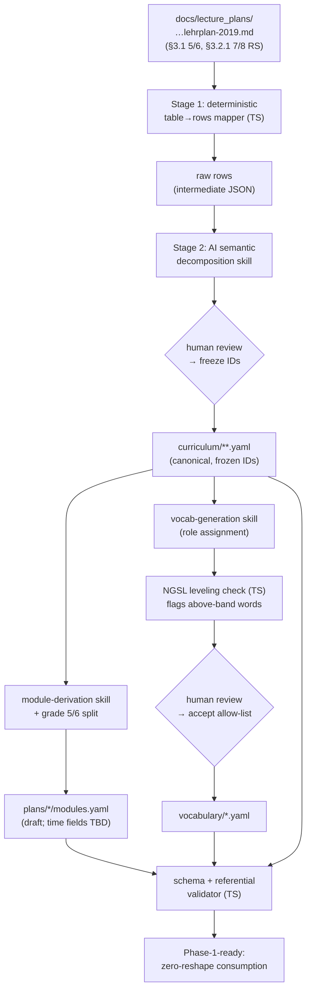
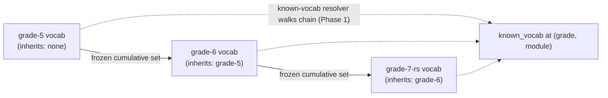

# feat: Phase 0 — curriculum extraction, module clusters, controlled vocabulary (grades 5-7)

## Summary

Phase 0 turns the Saxony-Anhalt Sekundarschule English Fachlehrplan (2019) into the three
foundational data artifacts every later phase consumes: a flat typed curriculum extraction,
draft module clusters, and an agent-generated controlled vocabulary. Scope is grades 5, 6, 7
— the combined **5/6 band** (no track, A1→A2) plus the **grade-7 portion of the 7/8
Realschule band** (Hauptschule out of scope, on the path to B1).

The work is data-first with a thin deterministic TypeScript tooling layer. Two stages produce
the curriculum: a deterministic markdown-table mapper (stage 1) and an AI-assisted semantic
decomposition of bundled Lehrplan prose (stage 2), with human review before IDs freeze.
Module clusters and per-module vocabulary follow the same derive-then-refine pattern. A schema
+ referential-integrity validator gates the whole set so the Phase-1 projection engine and the
coverage ledger consume these files with zero reshaping.

Vocabulary is generated **sequentially and cumulatively across grades** (5 → 6 → 7): each
grade inherits the frozen vocabulary of its predecessors and adds only genuinely new lexis, so
progression is monotonic, every word has a single canonical introduction point, and no grade
re-introduces a word already known. This makes the "a lesson may only use previously-introduced
vocabulary" rule enforceable at generation time.

Phase 0 populates only curriculum-derived fields. Time/calendar fields (`weeks`,
`weekly_lessons`, milestone dates, `buffer_weeks`) are left as explicit DRAFT/TBD for Phase 1.

---

## Problem Frame

Every downstream artifact — module goals, milestones, exercises, tests, coverage ledger —
must trace back to a stable competence ID extracted from the Lehrplan (00-overview §2
"Curriculum is the source of truth"). Today the curriculum exists only as prose in
`docs/lecture_plans/sachsen-anhalt-sekundarschule-englisch-lehrplan-2019-08-01.md`. Nothing
downstream can cite it, no coverage can be tracked, no vocabulary allow-list exists.

The Lehrplan prose is not mechanically parseable into teaching goals: a single bullet bundles
several grammar items with different modes (e.g. grade-7 RS Grammatik: "…verstehen
(*conditional clauses I und II, relative clauses*) und formulieren (*conditional clauses I,
relative clauses*)" → three grammar items, two modes each), and phrasing is inconsistent
across bands. This forces the two-stage extraction (01-data-model §3.1). The 5/6 band also
declares competences for a two-year span without naming the year, so module derivation must
additionally allocate each competence to grade 5 or grade 6.

Phase 0 succeeds when a teacher (and the Phase-1 engine) has: frozen competence IDs for grades
5-7, draft module clusters carrying target competences at a required depth, and a validated
per-module known-vocab allow-list — all schema-conformant and referentially closed.

---

## Requirements

- **R1 — In-scope curriculum extraction.** Extract the 5/6 band (Lehrplan §3.1) and the
  grade-7 portion of the 7/8 Realschule band (§3.2.1) into `curriculum/**.yaml`, capturing
  every entry type (`competence`, `grammar_item`, `content_field`, `text_type`,
  `vocabulary`[derived], `task_pattern`[pointer], `hint_method`, `reference`) with `id`,
  `source` (doc + location), and `used_in` tags. Conforms to 01-data-model §3.1.
- **R2 — Two-stage extraction with human freeze.** Extraction is deterministic table→rows
  mapping (stage 1) followed by AI-assisted semantic decomposition (stage 2). IDs freeze only
  after human review; the committed YAML is the source of truth; re-extraction produces a
  draft to diff, never a silent overwrite.
- **R3 — Draft module clusters + grade 5/6 allocation.** Derive draft module clusters
  (topics + goals + `covers[].required_depth` + `pedagogy.new_grammar`) for grade 5, grade 6,
  and grade-7 RS, including the agent-drafted allocation of the combined 5/6 band across two
  year-plans (grade 5 foundations, grade 6 extension), respecting prerequisite order. Conforms
  to 01-data-model §3.2.
- **R4 — Controlled vocabulary with required leveling check.** Agent-generate a per-module
  vocabulary list per class/grade and validate it with a REQUIRED leveling check before it
  becomes the hard allow-list. Conforms to 01-data-model §3.6a.
- **R5 — Schema conformance + referential closure.** All artifacts conform exactly to the
  §3.1/§3.2/§3.6 schemas so the Phase-1 projection engine and the §3.7 coverage ledger consume
  them with zero reshaping. Every `covers`/`assesses` ID resolves against the referenced
  curriculum band.
- **R6 — Trim scaffold to in-scope files.** Trim the §3.1 curriculum folder diagram and the
  on-disk `grade-bands/` folder to the in-scope files only (scope finding 9a); the
  out-of-scope band files are not created in Phase 0.
- **R7 — Wordlist choice recorded.** The leveling check uses a named permissive frequency
  wordlist with its license recorded, or a second automated CEFR-level pass as the documented
  alternative.
- **R8 — Cross-grade vocabulary progression + consistency.** The controlled vocabulary chains
  across grades 5 → 6 → 7: each grade's file declares its predecessor, is generated cumulatively
  (adds only new lexis on top of the inherited set), and guarantees every word has exactly one
  canonical introduction point (grade + module). The resolvable known-vocab set at any lesson is
  the monotonic union of the whole predecessor chain plus the current grade up to
  `taught_through`; no grade re-introduces an inherited word and nothing already known becomes
  un-known. This is the data-model precondition that lets Phase 1+ enforce "a lesson may only
  use previously-introduced vocabulary".

---

## Key Technical Decisions

- **KTD1 — Runtime + dependencies (settled by spec, minimal additions).** TypeScript, data as
  files in git, no DB (04-roadmap §5.0). Add only permissive libraries: `yaml` (ISC) for
  YAML parse/stringify, and `vitest` (MIT) as the test runner for TS-native DX. Node's built-in
  `node:test` is the fallback if we want zero test-runtime deps; the tradeoff is ergonomics,
  not capability. No framework, no bundler needed in Phase 0 (widgets/site are later phases).

- **KTD2 — Two-stage extraction, not a pure parser.** Stage 1 is a deterministic TS mapper
  that reads the Lehrplan markdown tables into raw typed rows (splitting `<br>–` cell bullets).
  Stage 2 is an AI-assisted decomposition skill that splits bundled prose into per-item,
  per-mode entries and assigns provisional IDs. A regex/table reader cannot do stage 2
  reliably (01-data-model §3.1, 00-overview §2).

- **KTD3 — IDs freeze after human review; re-extraction is draft-to-diff.** The reviewed,
  git-committed `curriculum/**.yaml` is canonical. Re-running extraction emits a parallel
  `*.draft.yaml` for diffing; it never overwrites the committed file. A manual override file
  is allowed for fixups. This is a hard rule — never silently regenerate frozen IDs.

- **KTD4 — Band-local competence IDs.** IDs are scoped within a band, mirroring the spec
  examples (`fk.k.hoer.1`, `fk.g.present_perfect`, `c.social.freizeit`). A topic that recurs
  across bands at a deeper mode (e.g. `simple present perfect`: 5/6 = understand only, 7/8 RS
  = produce) gets an independent `grammar_item` in each band file, each with its own `mode`.
  Modules reference IDs within the single band their `curriculum:` points at, so no cross-band
  ID collision arises. This keeps the coverage ledger's per-competence depth tracking clean.

- **KTD5 — Grade 5/6 split is agent-draft, teacher-refined, recorded in the plan.** The
  combined 5/6 band is allocated to grade 5 vs grade 6 by an agent draft the teacher refines,
  respecting prerequisite order (e.g. `simple present`/`present progressive` before
  `simple past`; `will/going-to future` after present tenses) and spiral progression (grade 5
  ≈ foundations, grade 6 ≈ extension). The allocation is our decision, recorded via a `grade:`
  field on each module and a short rationale note — not taken from the Lehrplan. Per 05-roadmap
  §5.8, an independent cross-check of the split is skipped for v1 (teacher review suffices).

- **KTD6 — Leveling wordlist = NGSL (CC BY-SA 4.0), CEFR-pass fallback.** The New General
  Service List (~2800 high-frequency headwords, frequency-ranked; Browne/Culligan/Phillips,
  licensed CC BY-SA 4.0) is vendored under `data/wordlists/` with attribution. The leveling
  script flags any generated word not in NGSL (or above an expected frequency band) for teacher
  review. Words legitimately absent from NGSL (proper nouns, topic-specific lexis) route to a
  second automated CEFR-level pass rather than an automatic reject. NGSL is frequency- not
  CEFR-graded, so the check is a frequency screen plus a CEFR fallback, exactly as
  01-data-model §3.6a permits.

- **KTD8 — Cross-grade vocab chain: sequential cumulative generation, single canonical
  introduction.** Each `vocabulary/*.yaml` gains `inherits_from` (the predecessor grade plan)
  and `cumulative: true`. Generation is chain-ordered — grade 5 first (empty inheritance),
  frozen; grade 6 generated with grade 5's full cumulative set passed as "already known,
  exclude"; grade 7 with grades 5+6. A grade's own module lists therefore contain *only* lexis
  first introduced at that grade. Resolution of known-vocab at (grade G, module M) walks the
  `inherits_from` chain: predecessors in full, current grade up to `taught_through`/M. The 5/6
  band is a special case — grade 6 `inherits_from: grade-5` while both point at the same
  `sa-sek-en-2019.5-6` curriculum, which is correct because that single band legitimately spans
  two school years. This mirrors the `prior_covered` accumulation the coverage model already
  uses for competences (§3.4/§3.7); vocabulary needs the same monotonic-accumulation guarantee
  and did not have it across grades. The `known_vocab_ref` resolver (Phase 1) must walk the
  chain; Phase 0 supplies `inherits_from` so it can, and the U5 validator proves the chain is
  acyclic, de-duplicated, and monotonic.

- **KTD7 — Phase 0 populates curriculum-derived fields only.** `module.id/title/
  content_fields/goals/covers[].required_depth/pedagogy.new_grammar`, competence IDs + modes,
  per-module vocab, and `taught_through` are populated now. `weeks`, `weekly_lessons`,
  `milestone` dates, `buffer_weeks`, and `total_weeks` are written as explicit DRAFT/TBD
  placeholders (a `draft: true` marker + sentinel values) so Phase 1 fills them without
  reshaping the file.

---

## High-Level Technical Design

The Phase 0 pipeline is a linear derive-then-validate flow with two human-review gates
(curriculum IDs, and the vocab leveling review). Deterministic steps are code; decomposition,
clustering, and vocab generation are AI skills.



The vocab lane (VOC → LEV → REV2 → VOCY) runs **once per grade in chain order** — grade 5,
then grade 6 with grade 5 frozen, then grade 7 with 5+6 frozen — so each run only proposes
lexis new to that grade (KTD8):



**Mode/depth mapping** (drives `required_depth` and coverage §3.7):

| Lehrplan verb | competence `mode` | module `required_depth` |
|---|---|---|
| verstehen / erkennen / erfassen | `understand` | `understand` (practiced is enough) |
| formulieren / anwenden / bilden / wiedergeben | `produce` | `produce` (production tasks / assessed) |
| both listed (verstehen … und formulieren) | `[understand, produce]` | `produce` |

---

## Output Structure

Greenfield layout created in Phase 0 (in-scope files only — R6):

```
package.json
tsconfig.json
data/
  wordlists/
    ngsl-1.2.csv                 # vendored NGSL + LICENSE-NGSL.txt (CC BY-SA 4.0)
src/
  schema/
    types.ts                     # TS types mirroring §3.1/§3.2/§3.6
    yaml.ts                      # load/parse/stringify helpers
  extract/
    tableMapper.ts               # stage 1 deterministic mapper
    tableMapper.test.ts
  validate/
    curriculumValidator.ts       # schema + entry-shape checks
    referentialValidator.ts      # covers/assesses ID resolution, produce-before-milestone
    validators.test.ts
  vocab/
    leveling.ts                  # NGSL frequency screen + CEFR-fallback flags
    leveling.test.ts
  cli/
    validateAll.ts               # single Phase-0 acceptance entrypoint
curriculum/
  sachsen-anhalt-sekundarschule-englisch-2019/
    meta.yaml
    grade-bands/
      5-6.yaml
      7-8-realschule.yaml        # grade-7 portion only
plans/
  grade-5/modules.yaml           # draft; time fields TBD
  grade-6/modules.yaml           # draft; time fields TBD
  grade-7-realschule/modules.yaml
vocabulary/
  grade-5.yaml                   # inherits: none
  grade-6.yaml                   # inherits: grade-5 (new lexis only)
  grade-7-realschule.yaml        # inherits: grade-6 (new lexis only)
docs/
  extraction-workflow.md         # two-stage + review + draft-to-diff procedure
.claude/skills/                  # decomposition / module / vocab skills (repo-local)
```

The tree is a scope declaration; per-unit `Files:` lists are authoritative.

---

## Implementation Units

### U1. TS project scaffold + schema types

**Goal:** Stand up the TypeScript project and define types mirroring the data-model schemas so
every later unit codes against one contract.

**Requirements:** R5.

**Dependencies:** none.

**Files:** `package.json`, `tsconfig.json`, `src/schema/types.ts`, `src/schema/yaml.ts`,
`src/schema/types.test.ts`, `.gitignore` (add `*.draft.yaml`, `node_modules/`, `material/`).

**Approach:** Configure TS (strict), vitest, and the `yaml` lib (KTD1). In `types.ts` define
interfaces for `CurriculumMeta`, `GradeBand`, `CompetenceEntry` (skill_area, statement, mode),
`GrammarItem` (topic, mode), `ContentField`, `TextType`, `TaskPatternPointer`, `HintMethod`,
`ReferenceEntry`, `Module` (with DRAFT-marked time fields optional/sentinel per KTD7),
`Covers` (`{id, required_depth}`), `VocabularyFile` (with `inherits_from?: string`,
`cumulative: boolean`, `modules: Record<string, string[]>`, `taught_through`, `overrides`).
`mode` is `('understand'|'produce')[]`; `required_depth` is `'understand'|'produce'`. `yaml.ts`
wraps parse/stringify with a typed load helper.

**Patterns to follow:** schema shapes in 01-data-model §3.1 (band file), §3.2 (`modules.yaml`),
§3.6a (`vocabulary/*.yaml`). Mirror the exact field names and nesting from those examples.

**Test scenarios:**
- Round-trip: a fixture YAML matching the §3.1 band example loads into `GradeBand` and
  re-stringifies without field loss.
- A `Module` with only curriculum-derived fields set and time fields as DRAFT sentinels
  type-checks and round-trips (KTD7).
- Malformed YAML (bad indent) surfaces a clear load error, not a silent `undefined`.

**Verification:** `vitest` runs green; `tsc --noEmit` clean.

---

### U2. Stage 1 — deterministic table→rows mapper

**Goal:** Parse the in-scope Lehrplan sections into raw typed rows deterministically, the
input to stage 2.

**Requirements:** R1, R2.

**Dependencies:** U1.

**Files:** `src/extract/tableMapper.ts`, `src/extract/tableMapper.test.ts`,
`src/extract/fixtures/` (small trimmed markdown slices of §3.1 and §3.2.1 tables).

**Approach:** Locate the in-scope sections by heading (`### 3.1 Schuljahrgänge 5/6`,
`#### 3.2.1 Schuljahrgänge 7/8`) and stop at the next same-or-higher heading. For each markdown
table under a labelled sub-block (Kommunikative Kompetenzen, sprachliche Mittel /
Grammatik / Wortschatz / Aussprache / Orthografie, Kommunikative Inhalte, Textsorten,
Interkulturell, Methodisch), emit raw rows: `{band, area, subarea, bereich, bulletText,
sourceLine}`, splitting each cell on `<br>–` into one row per bullet. No semantic
interpretation — preserve German text verbatim with provenance (file + line). Output an
intermediate JSON per band. Grade-7 RS extraction reads only §3.2.1; §3.3 (HS) is never
touched (R6).

**Patterns to follow:** section boundaries visible in the Lehrplan header map (lines 149, 218,
222, 287). Keep the mapper pure (string in → rows out) for testability.

**Test scenarios:**
- The 5/6 Grammatik cell yields the expected count of bullet rows, each carrying its source
  line and the raw German bullet text.
- A cell with inline italics markers (`*simple past*`) preserves them in `bulletText` (stage 2
  needs the parenthetical grammar terms).
- The mapper stops at `### 3.2` and does not bleed 5/6 rows into 7/8, and never emits rows from
  §3.3 Hauptschule.
- Empty/whitespace cells produce no rows (no blank-bullet artifacts).

**Verification:** running the mapper on the real Lehrplan produces stable row counts per area
for both in-scope bands; snapshot test on the trimmed fixtures.

---

### U3. Stage 2 — semantic decomposition skill + 5/6 band YAML

**Goal:** Decompose the 5/6 raw rows into per-item, per-mode typed entries and produce the
reviewed `5-6.yaml`. Start here because 5/6 is the cleanest input (single band, A1, no track).

**Requirements:** R1, R2, R6.

**Dependencies:** U2.

**Execution note:** AI-assisted step. Emit a `*.draft.yaml`; a human reviews and freezes IDs
before the canonical file is committed (KTD3). This unit's "green" state is validator pass
(U5) plus a completed review checklist, not unit tests over generated content.

**Files:** `.claude/skills/curriculum-decompose/SKILL.md` (+ prompt assets),
`curriculum/sachsen-anhalt-sekundarschule-englisch-2019/meta.yaml`,
`curriculum/sachsen-anhalt-sekundarschule-englisch-2019/grade-bands/5-6.yaml`,
`docs/extraction-workflow.md`.

**Approach:** The skill takes stage-1 rows + a decomposition guide and emits typed entries:
splits bundled grammar prose into one `grammar_item` per topic with its `mode` (per the
mode/depth table in HTD); maps each Kommunikative-Kompetenz bullet to a `competence` with
`skill_area` (listening/reading/speaking/writing/mediation) and `mode`; maps Kommunikative
Inhalte to `content_field`, Textsorten to `text_type` (receptive/productive), Methodisch
bullets to `hint_method`. Assign band-local IDs per KTD4 (`fk.k.hoer.N`, `fk.g.<topic>`,
`c.<field>.<slug>`). Tag every entry with `used_in` and `source` (file + line from stage 1).
`vocabulary` and `task_pattern` are placeholders/pointers here (vocab is U6; task_pattern
carries format/AFB pointer only, never NbA text). Write `meta.yaml` (state, school type,
subject, valid_from 2019-08-01, source_file, `cefr_target` 5/6 = A1→A2). Document the
draft-to-diff + freeze procedure in `docs/extraction-workflow.md`.

**Grammar decomposition targets for 5/6** (from Lehrplan §3.1 Grammatik): `simple present`,
`present progressive`, `simple past`, `going to future`, `will future`, `simple present
perfect` (understand only), numbers, prepositions, pronouns, articles, singular/plural of
nouns, genitive, adjectives + comparison.

**Test scenarios:**
- `Test expectation: none (AI-emitted data)` — conformance is enforced by U5's validator and
  the review checklist in `docs/extraction-workflow.md`. Review checklist asserts: every
  bundled bullet was split; `simple present perfect` carries `mode: [understand]` (not
  produce); every entry has `id` + `source` + `used_in`; no §3.3 content present.

**Verification:** U5 validator passes on `5-6.yaml`; reviewer signs the checklist; IDs frozen.

---

### U4. Stage 2 — grade-7 Realschule band YAML

**Goal:** Produce the reviewed `7-8-realschule.yaml` (grade-7 portion) reusing the U3 method.

**Requirements:** R1, R2, R6.

**Dependencies:** U3.

**Execution note:** same AI-assisted + human-freeze posture as U3.

**Files:**
`curriculum/sachsen-anhalt-sekundarschule-englisch-2019/grade-bands/7-8-realschule.yaml`.

**Approach:** Run the decomposition skill on the §3.2.1 rows. The hard decomposition case lives
here: the Grammatik cell bundles `active/passive voice` (understand+produce), `simple present
perfect` (understand+produce), `question tag` (understand), `conditional clauses I und II`
(understand) with `conditional clauses I` also produce, `relative clauses` (understand+produce),
`gerund` (understand+produce), `modals + substitute forms incl. negation` (understand+produce),
`adverbs` (produce) → distinct `grammar_item`s with precise per-item modes per the HTD table.
`cefr_target` on this band = B1 (end of grade 10); mark the file as grade-7 portion of the 7/8
band (grade-8 competences may be present in the source but are out of the grade-7 module scope
— capture them as entries but exclude from grade-7 modules in U7). Hauptschule (§3.3) excluded.

**Test scenarios:**
- `Test expectation: none (AI-emitted data)` — review checklist asserts: `conditional_1` has
  `mode: [understand, produce]` while `conditional_2` has `mode: [understand]`; `question_tag`
  understand-only; passive voice both modes; all IDs band-local and distinct from 5/6 IDs by
  band namespace (KTD4).

**Verification:** U5 validator passes on `7-8-realschule.yaml`; reviewer signs checklist.

---

### U5. Schema + referential-integrity validator

**Goal:** A deterministic validator that gates every committed artifact against the schemas and
enforces referential closure — the schema-conformance step R5 requires.

**Requirements:** R5.

**Dependencies:** U1 (types); consumes outputs of U3/U4/U6/U7 at run time.

**Files:** `src/validate/curriculumValidator.ts`, `src/validate/referentialValidator.ts`,
`src/validate/validators.test.ts`, `src/validate/fixtures/`.

**Approach:** `curriculumValidator` checks each entry has `id`, `source`, `used_in` (from the
allowed set), and type-correct fields; IDs unique within a band; `mode` values valid.
`referentialValidator` loads a `modules.yaml` + its referenced band and asserts every
`covers[].id` and `milestone.assesses[]` resolves to an entry in that band; asserts every
grammar competence with curriculum `mode` including `produce` is covered by some module marked
`required_depth: produce` before its assessing milestone (coverage lint, §3.2); asserts vocab
`generated_from.curriculum` matches an existing band. A `vocabChainValidator` (R8/KTD8) asserts:
`inherits_from` resolves to an existing vocab file and the chain is acyclic; each grade's own
module words are disjoint from its full inherited cumulative set (no re-introduction — every
word canonical once); the resolvable known-set is monotonic (a predecessor's cumulative set is a
subset of every successor's), so nothing already known becomes un-known; and (warn, not fail) it
reports words that appear in a later grade but would have been level-appropriate earlier. The
Phase-1-only checks
(`sum(weeks)+buffer==total_weeks`, `weekly_lessons` vs calendar) are explicitly **skipped when
time fields are DRAFT** (KTD7) — the validator recognizes the DRAFT marker and reports them as
"deferred to Phase 1", not failures.

**Patterns to follow:** the constraint list in 01-data-model §3.2 ("Constraint checks
(deterministic, run on save)").

**Test scenarios:**
- Valid fixture set passes with zero errors.
- A module `covers` an ID absent from its band → error naming the ID and file.
- A `produce`-mode grammar competence with no producing module before its milestone → coverage
  lint error.
- An entry missing `source` → schema error.
- A module with DRAFT time fields → the weeks-sum check is reported deferred, not failed.
- A `used_in` value outside `{module_construction, lesson_planning, base_material,
  test_generation}` → error.
- Chain: grade-6 re-lists a word already in grade-5's cumulative set → re-introduction error
  naming the word and both files.
- Chain: `inherits_from` pointing at a missing file → error; a cycle (6→5→6) → error.
- Chain: grade-7 cumulative set omits a grade-5 word (monotonicity broken) → error.
- A valid 3-grade chain (5 → 6 → 7) with disjoint per-grade lists passes clean.

**Verification:** `vitest` green across positive and negative fixtures, including the vocab
chain cases.

---

### U6. Controlled vocabulary — sequential cumulative generation + NGSL leveling check

**Goal:** Agent-generate per-module vocabulary for grades 5, 6, 7 **in chain order**, each grade
inheriting its predecessors' frozen vocabulary and adding only new lexis, then validate each with
the required NGSL leveling check before it becomes the allow-list.

**Requirements:** R4, R7, R8.

**Dependencies:** U3, U4 (bands supply content fields + grammar + text types per module); U7
(module lists define the per-module buckets) — may run against draft modules and re-sync.

**Execution note:** vocab generation is an AI skill; the leveling check + chain validation are
deterministic TS. Generation is **strictly ordered** (grade 5 frozen before grade 6 runs, grade 6
frozen before grade 7) — a predecessor must be reviewed and accepted before its successor
generates, so the "already known, exclude" set handed to each run is stable (KTD8). Human review
(second gate) accepts each grade's allow-list after leveling + chain flags are resolved
(KTD3/KTD6).

**Files:** `.claude/skills/vocab-generate/SKILL.md`, `data/wordlists/ngsl-1.2.csv`,
`data/wordlists/LICENSE-NGSL.txt`, `src/vocab/leveling.ts`, `src/vocab/leveling.test.ts`,
`vocabulary/grade-5.yaml`, `vocabulary/grade-6.yaml`, `vocabulary/grade-7-realschule.yaml`.

**Approach:** Vendor NGSL (CC BY-SA 4.0) with its license file (KTD6). For each grade in chain
order, the vocab skill runs role assignment ("SA grade-N English teacher; list productive +
receptive lexis a pupil has met by end of module M, given these content fields, this grammar,
these text types") **with the frozen cumulative vocabulary of all predecessor grades supplied as
"already known — do not repeat"**, so it proposes only lexis new to grade N (KTD8). `leveling.ts`
screens each proposed word against NGSL frequency: in-list → accepted; not-in-list → flagged for
the CEFR-fallback pass and teacher review (proper nouns/topic lexis expected to be flagged, not
auto-removed). The chain check (shared with U5) rejects any proposed word already in the inherited
set before the file is written. Write `vocabulary/<grade>.yaml` with `inherits_from` (predecessor
grade, empty for grade 5), `cumulative: true`, `generated_from` (curriculum +
`method: agent-role-assignment`), `required_leveling` (`frequency_list: ngsl-1.2`), `modules:`
map (new-at-this-grade lexis only), `taught_through` (initial marker), and optional `overrides`.
Committed file is source of truth; regeneration = draft to diff (KTD3). Because generation is
ordered, freeze grade 5 before generating grade 6, and grade 6 before grade 7.

**Patterns to follow:** the `vocabulary/*.yaml` shape in 01-data-model §3.6a.

**Test scenarios:**
- `leveling.ts`: a word present in NGSL is `accepted`; a word absent is `flagged`.
- Case/whitespace-insensitive match ("Free Time" vs "free time"); multi-word items screened by
  head word or whole-phrase rule (documented).
- A flagged proper noun routes to `cefr_fallback`, not `rejected`.
- Empty module list → leveling returns empty, no crash.
- `vocabulary/*.yaml` fixture loads into `VocabularyFile` and `generated_from.curriculum`
  resolves via U5's referential validator.
- Chain exclusion: given grade-5 cumulative `["free time", "hobby"]`, a grade-6 proposal
  containing "hobby" has "hobby" rejected as already-known before write; a genuinely new word
  ("region") passes.
- Grade-5 vocab generates with empty `inherits_from` and no exclusions.

**Verification:** leveling + chain tests green; every generated `vocabulary/*.yaml` passes U5
(including the vocab chain validator); the 5 → 6 → 7 chain is de-duplicated and monotonic;
leveling flags reviewed and resolved before each grade's allow-list is marked accepted.

---

### U7. Draft module clusters + grade 5/6 allocation

**Goal:** Derive draft module clusters for grade 5, grade 6, and grade-7 RS, including the
5/6-band grade allocation, with curriculum-derived fields populated and time fields DRAFT/TBD.

**Requirements:** R3, R5, R7.

**Dependencies:** U3, U4 (bands supply competences/content fields/text types).

**Execution note:** cluster derivation + grade split is an AI draft the teacher refines (KTD5);
conformance enforced by U5.

**Files:** `.claude/skills/module-derive/SKILL.md`, `plans/grade-5/modules.yaml`,
`plans/grade-5/class.yaml`, `plans/grade-6/modules.yaml`, `plans/grade-6/class.yaml`,
`plans/grade-7-realschule/modules.yaml`, `plans/grade-7-realschule/class.yaml`,
`docs/module-derivation-notes.md` (records the grade 5/6 split rationale, KTD5).

**Approach:** The derivation skill groups each band's content fields + grammar progression +
skill competences into coherent topic clusters (draft modules). Each module carries
`id`, `title`, `content_fields`, `goals`, `covers[]` with `required_depth` (mapped from mode
per HTD), `pedagogy.new_grammar`, and a milestone stub (`type`, `assesses`) — with
`grade_weight` and any dates left DRAFT. `weeks`, `weekly_lessons`, `total_weeks`,
`buffer_weeks` are DRAFT sentinels (KTD7). For the 5/6 band, the skill additionally allocates
each competence/grammar item to grade 5 or grade 6 (prerequisite order: present tenses →
`simple past` → futures; spiral: grade 5 foundations, grade 6 extension), producing two module
files, and records the rationale in `docs/module-derivation-notes.md`. Bias clustering toward
the "gute Aufgaben" hallmarks — Vernetzung + Differenzierung (06-exercise-design-reference).
`class.yaml` carries name/grade/track/curriculum ref (weekly count deferred).

**Patterns to follow:** `modules.yaml` in 01-data-model §3.2; the grade-split reasoning in
§3.1 ("module derivation also allocates each competence to grade 5 or grade 6").

**Test scenarios:**
- `Test expectation: none (AI-emitted data)` — enforced by U5. Review checklist asserts: every
  produce-mode grammar item in each band is covered by a module before its assessing milestone;
  `simple past` is not allocated to grade 5 before present tenses; each grade-7 module's
  `covers` resolves against `7-8-realschule.yaml`; time fields are DRAFT sentinels, not
  fabricated values.

**Verification:** U5 referential + coverage lint passes for all three module files; grade-split
rationale recorded; teacher review of the split complete.

---

### U8. Phase 0 acceptance harness + spec/scaffold trim

**Goal:** One command validates the whole Phase 0 artifact set, and the §3.1 spec diagram is
trimmed to in-scope files.

**Requirements:** R5, R6, R8.

**Dependencies:** U5, U3, U4, U6, U7.

**Files:** `src/cli/validateAll.ts`, `package.json` (add a `validate` script),
`docs/spec/01-data-model.md` (trim the §3.1 folder diagram to in-scope files with a scope note;
amend §3.6a and §3.4 for the cross-grade vocab chain), `README.md` (Phase 0 artifact map + run
instructions).

**Approach:** `validateAll.ts` walks `curriculum/`, `plans/`, `vocabulary/`, runs the U5
curriculum + referential + vocab-chain validators across every file, aggregates errors, and
exits non-zero on any failure — the single gate proving R5 + R8 (zero-reshape Phase-1
consumption). Trim the §3.1 diagram to `meta.yaml` + `grade-bands/{5-6.yaml,
7-8-realschule.yaml}` with a note that out-of-scope bands (`7-8-hauptschule`, `9-10-realschule`,
`9-hauptschule`) are additive later (R6, scope finding 9a). Amend the spec to close the
vocab-progression gap: §3.6a gains `inherits_from` + `cumulative` + the
single-canonical-introduction / no-re-introduction rule; §3.4's `known_vocab_ref` description
states the resolver walks the `inherits_from` chain across grades (predecessors in full, current
grade up to `taught_through`). README documents the derive-then-review workflow, the
chain-ordered vocab generation, and the draft-to-diff rule.

**Test scenarios:**
- `Test expectation: none (integration entrypoint)` — exercised by running `validate` against
  the committed artifacts; covered by U5's unit tests. Manual check: `validate` exits 0 on the
  full committed set and non-zero when a fixture with a dangling `covers` ID is dropped in.

**Verification:** `npm run validate` exits 0 across all committed Phase 0 artifacts; the §3.1
diagram shows only in-scope files.

---

## Scope Boundaries

**In scope (Phase 0):** curriculum extraction for the 5/6 band + grade-7 RS band; the two-stage
extraction tooling + skill; draft module clusters with the grade 5/6 split; agent-generated
per-module vocabulary + NGSL leveling check; the schema + referential validator and acceptance
harness; the scaffold/diagram trim.

### Deferred to Follow-Up Work (Phase 1+)

- Time/calendar fields on modules (`weeks`, `weekly_lessons`, `total_weeks`, `buffer_weeks`,
  milestone dates) — written as DRAFT now, filled in Phase 1.
- The projection engine, `whichModule(date)`, drift report, and the coverage-ledger folding
  logic (Phase 1) — Phase 0 only guarantees the schemas they will read.
- Grade-8/9/10 bands and the Hauptschule track (files not created; additive later).
- The ontology comparison/validation check against `FWU-DE/lehrplan-ontologie` (04-roadmap
  §5.7, low priority, blocked on nothing).
- Right-sizing/deferring a k12-style `evals/` harness (scope finding 9b) — not built until
  multiple teachers or a quality-regression problem exists.

### Out of scope (this product / later phases)

- Projection, spec export, web site, lesson/exercise generation, the `klassenarbeit` test
  skill (Phases 2-4).
- Student accounts, grading of record, LMS integration (04-roadmap §5.4).

---

## Verification Contract

- `tsc --noEmit` clean; `vitest` green for U1, U2, U5, U6.
- `npm run validate` (U8) exits 0 across every committed file under `curriculum/`, `plans/`,
  `vocabulary/`: schema-conformant and referentially closed (R5).
- Every `covers`/`assesses`/`generated_from.curriculum` ID resolves against its band (R5).
- Both curriculum bands and all three module files carry a completed human-review sign-off per
  `docs/extraction-workflow.md`; IDs are frozen (R2).
- Every `vocabulary/*.yaml` records `required_leveling: {frequency_list: ngsl-1.2}` and its
  leveling flags are reviewed/resolved before acceptance (R4, R7); NGSL license file present.
- The vocab chain (5 → 6 → 7) validates: `inherits_from` resolves and is acyclic, per-grade
  lists are disjoint from their inherited cumulative set (no re-introduction), and the known-set
  is monotonic across grades (R8). Each grade was frozen before its successor generated.
- Module time fields are DRAFT sentinels, and the validator reports the Phase-1 sum/weekly
  checks as deferred, not failed (KTD7).
- `docs/spec/01-data-model.md` §3.1 diagram lists only in-scope files (R6).

---

## Definition of Done

Phase 0 is done when: `curriculum/**.yaml` holds the reviewed, frozen extraction of the 5/6 and
grade-7 RS bands; `plans/grade-{5,6,7-realschule}/modules.yaml` hold teacher-refined draft
clusters with curriculum-derived fields populated and time fields DRAFT; `vocabulary/*.yaml`
hold accepted, NGSL-leveled allow-lists that chain 5 → 6 → 7 (de-duplicated, monotonic, single
canonical introduction per word); `npm run validate` passes with full referential closure and a
valid vocab chain; and the spec (§3.1 scaffold trim, §3.6a/§3.4 vocab-chain amendment) is
updated. The Phase-1 projection engine and coverage ledger can consume all three artifact types
with zero reshaping, and the chained known-vocab set is resolvable for lesson-time enforcement.

---

## Open Questions

- **Vocab↔module coupling order (U6/U7).** Vocabulary buckets key off module boundaries, but
  modules are drafts the teacher refines. Resolve at execution: generate vocab against the
  drafted modules, then re-run leveling + chain checks if the teacher re-buckets. Not a blocker
  — both files are draft-to-diff.
- **Chain re-generation cost (U6/KTD8).** Because generation is ordered and each grade excludes
  its predecessors, a change to grade 5's vocab invalidates the exclusion sets of grades 6 and 7
  and may require regenerating them (draft-to-diff). Acceptable for v1's single 3-grade chain;
  revisit if chains grow. The lesson-time enforcement of "only previously-introduced vocab"
  itself lives in the Phase-1+ generator (it treats the chained cumulative set as the hard
  allow-list) — Phase 0 only guarantees the resolvable, consistent data.
- **Grade-7 vs grade-8 entries in the 7/8 band.** The source does not split 7 from 8; U4
  captures all 7/8 RS entries but U7 must decide which belong to the grade-7 year-plan.
  Deferred to the derivation step + teacher review (same posture as the 5/6 split); no
  independent cross-check for v1 (§5.8).
- **Skill distribution (repo-local vs plugin).** Phase 0 skills sit in `.claude/skills/`;
  final packaging (04-roadmap open Q7) is settled later and does not affect the artifacts.
- **Multi-word vocab leveling rule.** Whether to screen collocations ("once a week") by head
  word or whole phrase — decide in U6 and document; low risk.

---

## Sources & Research

- Origin specs: `docs/spec/00-overview.md`, `docs/spec/01-data-model.md` (§3.1, §3.2, §3.6,
  §3.7), `docs/spec/04-roadmap.md` (§5.0, §5.1, §5.8), `docs/spec/06-exercise-design-reference.md`.
- Curriculum source: `docs/lecture_plans/sachsen-anhalt-sekundarschule-englisch-lehrplan-2019-08-01.md`
  (§3.1 5/6 band lines 149-216; §3.2.1 7/8 RS band lines 222-285).
- Wordlist (KTD6): New General Service List, Browne/Culligan/Phillips — CC BY-SA 4.0,
  frequency-ranked ~2800 headwords. https://www.newgeneralservicelist.org/home ,
  https://en.wikipedia.org/wiki/New_General_Service_List . License verified as the permissive
  choice satisfying research item 3b; CEFR-pass fallback documented per §3.6a.
- Prior art (04-roadmap §5.7, not adopted in Phase 0): `anthropics/k12-teacher-skills`
  (Apache-2.0) as the skill+evals pattern to mirror later; `FWU-DE/lehrplan-ontologie`
  (comparison-only, deferred).
