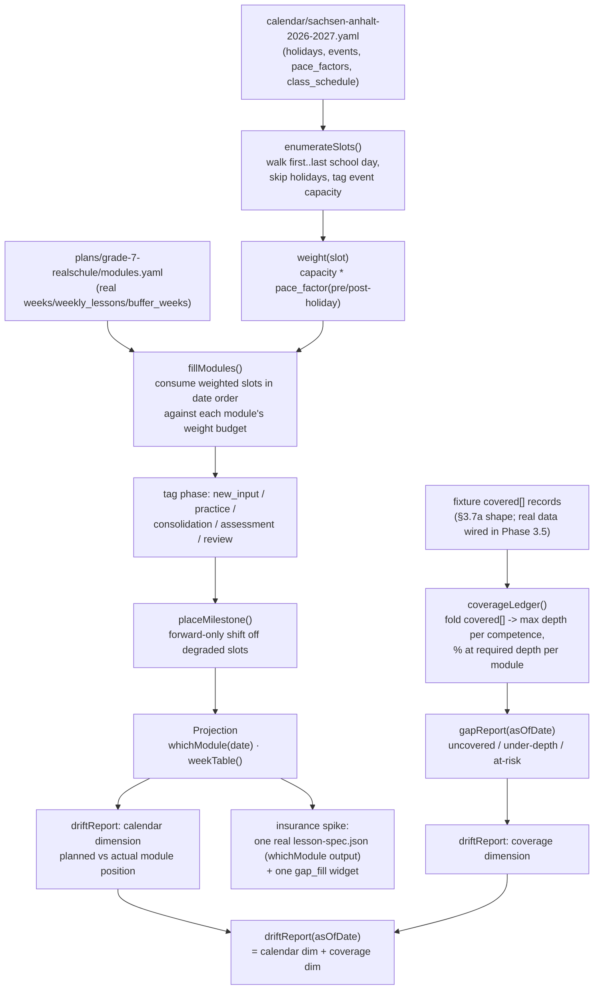

# feat: Phase 1 — projection engine, coverage ledger, real calendar (grade 7)

## Summary

Phase 1 turns Phase 0's static, DRAFT-time-fielded grade-7 plan into a live, date-aware
system. It fetches and caches a real Sachsen-Anhalt 2026/2027 school-year calendar
(`calendar/*.yaml`, Component C), fills in the module time budgets Phase 0 deliberately
left as `DRAFT` (KTD7 of the Phase 0 plan), and builds the deterministic projection engine
(Component D) that maps calendar dates onto module positions: `whichModule(date)`, a week
table, and a two-dimensional `driftReport`. It also builds the coverage ledger and gap
report (§3.7) — the reverse, bottom-up half of the coverage model — as pure schema +
folding logic, since no real lessons exist yet to fold (that wiring is Phase 3.5).

The algorithm is already fully specified in `docs/spec/02-projection.md` (six deterministic
steps: enumerate slots, weight by pace, compute budgets, fill modules against weighted
slots, tag phase, place milestones forward-only) — this plan's job is translating that
spec into typed, tested TypeScript, not designing the algorithm from scratch.

Phase 1 closes with the roadmap's "insurance spike": one hand-authored `lesson-spec.json`
(§3.4 shape, for a real date the projection engine picks) and one working `gap_fill`
widget, built early to sanity-check output quality before Phase 3 commits to the full
generator design.

---

## Problem Frame

Phase 0 delivered frozen curriculum bands, draft module clusters, and chain-ordered
vocabulary — but every module's `weeks`, `weekly_lessons`, `buffer_weeks`, and
`total_weeks` are explicit `DRAFT` sentinels, and there is no calendar, no way to answer
"what module are we teaching on 2026-11-03", and no mechanism to track what was actually
taught versus what was planned. Phase 1 is what makes the plan *operational*: a real
calendar, a deterministic date→module projection, and the schema for tracking coverage
once lessons start being generated (Phase 3+).

Scope is **grade 7 only** (`plans/grade-7-realschule/`), per roadmap §5.1: "Finalize one
module sequence for grade 7, one calendar." Grades 5 and 6 stay DRAFT until a later phase
repeats this same recipe for them — the engine built here is class-agnostic and reusable,
just not run against grade 5/6 in this phase.

---

## Requirements

- **R1 — Real school-year calendar.** Fetch Sachsen-Anhalt (`DE-ST`) school holidays and
  public holidays for **2026/2027** from OpenHolidaysAPI and cache them into
  `calendar/sachsen-anhalt-2026-2027.yaml` (§3.3 shape) — no runtime API dependency after
  the fetch. Teacher-editable `events[]`, `pace_factors`, `class_schedule` fields per the
  spec example.
- **R2 — Finalized grade-7 module time budget.** Replace `plans/grade-7-realschule/`'s
  `DRAFT` time fields (`weeks` per module, `weekly_lessons`, `buffer_weeks`, `total_weeks`)
  with real, teacher-confirmable values so the projection engine has an actual budget to
  fill. Conforms to 01-data-model §3.2's constraint list (`sum(weeks) + buffer == total`).
- **R3 — Deterministic projection engine (Component D).** Implement 02-projection.md's
  six-step algorithm: enumerate teaching slots from the calendar + class schedule, weight
  each slot by pace factors, convert module `weeks` into a weight budget, fill modules
  against weighted slots in date order, tag each slot's phase, and place milestones
  forward-only (never before the assessed competence was taught).
- **R4 — Projection queries.** `whichModule(date)`, `weekTable()`, and the *calendar*
  dimension of `driftReport(asOfDate)` ("behind by N slots").
- **R5 — Coverage ledger schema + folding logic (§3.7a/b).** `coverageLedger()` folds a
  set of per-lesson `covered[]` records (competence, depth, exercise types) into
  per-competence max depth and per-module `% at required depth`. Pure, deterministic,
  file-based (`coverage/<class>.json`, generated — never hand-edited). Depth states:
  `planned → introduced → practiced → assessed` (+ teacher-set `mastered` override).
- **R6 — Gap report (§3.7c) + coverage-dimension drift.** `gapReport(asOfDate)`:
  uncovered / under-depth / at-risk competences per module and for the year. Feeds the
  second dimension of `driftReport`.
- **R7 — Insurance spike.** One hand-authored `lesson-spec.json` (§3.4 shape) for a real
  date the projection engine actually picks, plus one working `gap_fill` widget consuming
  it — self-contained HTML, vanilla/compiled TS, no framework (06-exercise-design-reference
  §"Decision: custom TypeScript widgets, NOT H5P"). Sanity-checks output quality before
  Phase 3's generator design is locked in.
- **R8 — Validation extended to the new artifact types.** `src/validate/*` and
  `npm run validate` (Phase 0's U8 harness) grow checks for the calendar file and the
  coverage ledger/gap-report shapes, following the existing `curriculumValidator.ts` /
  `referentialValidator.ts` pattern rather than inventing a parallel one.

---

## Key Technical Decisions

- **KTD1 — Calendar data source: OpenHolidaysAPI, fetch-once-cache-forever.**
  `docs/spec/research/04-ferien-data.md` already recommends this API from a prior
  verified research pass; re-verified live today (2026-07-25) for `DE-ST`,
  `2026-08-01..2027-31-07`: `GET /SchoolHolidays` returns 7 real holiday periods, `GET
  /PublicHolidays` returns real public holidays including Sachsen-Anhalt's Reformation
  Day. No further external research needed. Same pattern as Phase 0's NGSL vendoring
  (`data/wordlists/`): fetch once via a small script, commit the result, never depend on
  the API at runtime.
- **KTD2 — School year = 2026/2027, not the roadmap's example 2025/2026.** The roadmap
  text (§5.1) was written before 2025/2026 became the past relative to today's date
  (2026-07-25); Phase 0's own `class.yaml` files already anticipated this
  (`grade-7-realschule-2026`). Confirmed with the user.
- **KTD3 — `weekly_lessons` is a documented assumption, not an invented fact.** No
  Stundentafel (weekly-hours table) exists in this repo's sources
  (`docs/lecture_plans/`, `docs/rules/`, `docs/spec/`) to confirm grade 7's actual English
  lesson count. Rather than silently asserting a number, U2 uses a clearly-flagged
  placeholder (3 lessons/week — a common default for a second/continued foreign language
  at this level) and the plan records it as an **Open Question requiring teacher
  confirmation** before the projection is treated as authoritative for real scheduling.
- **KTD4 — Projection engine is pure, deterministic TS — no AI, fully unit-testable.**
  Matches 02-projection.md's own framing exactly and mirrors Phase 0's
  `src/extract/tableMapper.ts` "pure function, string/data in → typed data out" pattern.
  No new runtime dependencies.
- **KTD5 — Coverage ledger is built and tested against fixture `covered[]` data in Phase
  1, not live lesson output.** No lessons exist yet (Phase 3 generates them; Phase 3.5
  wires live folding per roadmap). The folding *logic* must be correct and fixture-tested
  now so Phase 3.5 only has to wire real data through an already-proven function.
- **KTD6 — Milestone placement is a hard forward-only invariant.** 02-projection.md step 6
  is explicit: shift a test forward to the next healthy slot, never earlier — an earlier
  shift could place a test before its assessed competence was taught, which is the one
  invariant the whole coverage model depends on (§5.6 "taught-before-test"). This gets a
  dedicated, explicitly-named test scenario in U4, not just incidental coverage.
- **KTD7 — Insurance-spike widget stays vanilla/self-contained TS, per the existing
  06-exercise-design-reference decision — not reopening the framework question.** The
  spec already decided against a UI framework for exercise widgets ("custom TypeScript
  widgets, NOT H5P... compiled + inlined to self-contained single HTML files") and
  separately for the web calendar view ("static-gen HTML + small inline JS... no
  backend/SPA", Component F). The user's suggestion to look at calendar-view frameworks
  (mail/schedule-app style) is reasonable but targets Phase 2's web tool, which is out of
  scope here — noted under Open Questions for that phase, not acted on now.

---

## High-Level Technical Design



**Mode/depth recap** (unchanged from Phase 0, load-bearing here too): a module's
`covers[].required_depth: understand` is satisfied by ledger depth `practiced`;
`required_depth: produce` requires ledger depth `practiced` with production exercise
types, or `assessed`.

---

## Output Structure

Additive to Phase 0's layout (in-scope: grade 7 only):

```
calendar/
  sachsen-anhalt-2026-2027.yaml       # fetched once from OpenHolidaysAPI, cached
src/
  calendar/
    fetchHolidays.ts                  # rerunnable fetch script -> calendar/*.yaml
    fetchHolidays.test.ts
  projection/
    types.ts                          # TeachingSlot, ModulePlacement, WeekTableRow, DriftReport
    slots.ts                          # steps 1-2: enumerate + weight
    slots.test.ts
    fillModules.ts                    # steps 3-6: budget, fill, phase tag, milestone placement
    fillModules.test.ts
    query.ts                          # whichModule, weekTable, calendar-dimension drift
    query.test.ts
  coverage/
    types.ts                          # CoveredRecord (§3.7a), LedgerEntry, GapReport
    ledger.ts                         # coverageLedger() folding
    ledger.test.ts
    gapReport.ts                      # gapReport()
    gapReport.test.ts
    driftReport.ts                    # merges calendar + coverage dimensions
    driftReport.test.ts
    fixtures/
      covered-sample.json             # §3.7a-shaped fixture, hand-authored
artifacts/
  grade-7-realschule-2026/
    <picked-date>/
      lesson-spec.json                # insurance spike, hand-authored, §3.4 shape
      materials/
        01-gap-fill-<topic>.html      # insurance spike widget
src/widgets/
  gapFill.ts                          # minimal self-contained gap_fill widget source
```

The tree is a scope declaration; per-unit `Files:` lists are authoritative.

---

## Implementation Units

### U1. Fetch + cache the real 2026/2027 Sachsen-Anhalt calendar

**Goal:** Produce the committed `calendar/sachsen-anhalt-2026-2027.yaml` from real
OpenHolidaysAPI data, matching the §3.3 shape.

**Requirements:** R1.

**Dependencies:** none.

**Files:** `src/calendar/fetchHolidays.ts`, `src/calendar/fetchHolidays.test.ts`,
`src/schema/types.ts` (add `CalendarFile`/`Holiday`/`Event`/`PaceFactors`/`ClassSchedule`
types), `calendar/sachsen-anhalt-2026-2027.yaml`.

**Approach:** `fetchHolidays.ts` calls `GET /SchoolHolidays` and `GET /PublicHolidays` on
`openholidaysapi.org` for `countryIsoCode=DE&subdivisionCode=DE-ST` across
`2026-08-01..2027-07-31`, maps the response into the §3.3 `holidays[]` shape (name +
from/to), and writes `calendar/sachsen-anhalt-2026-2027.yaml`. `first_school_day` /
`last_school_day` are derived from the fetched Summer-holiday boundaries (first school day
= day after the prior summer holiday's `endDate`; last school day = day before the next
summer holiday's `startDate`). `events[]` starts empty (teacher-entered per-school events
— Projektwoche, Sportfest, Wandertag — are explicitly not in the API, per
`docs/spec/research/04-ferien-data.md`). `pace_factors` uses the §3.3 example defaults
(`pre_holiday_days: 2, pre_holiday_factor: 0.6, post_holiday_days: 2,
post_holiday_factor: 0.8`) as a documented starting point. `class_schedule` gets one entry
for `grade-7-realschule-2026` with `lesson_days` per KTD3's placeholder assumption.

**Patterns to follow:** `src/vocab/leveling.ts`'s `loadNgslSet` — a small, pure loader —
for the parse side; Phase 0's `data/wordlists/` vendoring convention (fetch once, commit,
document provenance) for the "no runtime dependency" rule. Verified request shape:
`docs/spec/research/04-ferien-data.md`.

**Test scenarios:**
- Given a fixture API response (recorded from today's real fetch), maps to the correct
  number of `holidays[]` entries with correct `name`/`from`/`to`.
- `first_school_day` / `last_school_day` are derived correctly from the two Summer-holiday
  boundary entries in the fixture.
- A malformed/empty API response surfaces a clear error, not a silently-empty calendar.
- Re-running against the same fixture is idempotent (same output).

**Verification:** `vitest` green; `calendar/sachsen-anhalt-2026-2027.yaml` committed and
loads via `src/schema/yaml.ts`'s `loadYaml<CalendarFile>`.

---

### U2. Finalize grade-7 module time budget

**Goal:** Replace `plans/grade-7-realschule/modules.yaml`'s `DRAFT` time-field sentinels
with real values, giving the projection engine an actual budget to fill.

**Requirements:** R2.

**Dependencies:** U1 (needs the real calendar's total available teaching weeks as a sanity
bound for the budget).

**Files:** `plans/grade-7-realschule/modules.yaml` (modify in place), `plans/grade-7-realschule/class.yaml`
(add `weekly_lessons`-relevant schedule note if needed).

**Approach:** For each of the three grade-7 modules (`m1` Back in school, `m2` What has
changed, `m3` Media habits), assign a real `weeks` value proportional to its `covers[]`
size and grammar complexity (§3.2's own worked example uses 5-6 week modules); set
`weekly_lessons: 3` (KTD3's documented placeholder) and `buffer_weeks` such that
`sum(module.weeks) + buffer_weeks == total_weeks`, per the 01-data-model §3.2 constraint
this repo's own `checkTimeFields` (Phase 0, `src/validate/referentialValidator.ts`)
already enforces once fields stop being `DRAFT`. Remove the `draft: true` markers on the
modules file and each module now that real values are set.

**Patterns to follow:** the worked example in `01-data-model.md` §3.2 (`m1: weeks: 5`,
`buffer_weeks: 3`). `docs/module-derivation-notes.md`'s existing rationale for what each
module covers (do not re-litigate the grade-7/8 split there).

**Test scenarios:** `Test expectation: none (data edit, not new code)` — enforced by the
existing `checkTimeFields` / `validateModulesReferential` in
`src/validate/referentialValidator.ts`, exercised via `npm run validate`.

**Verification:** `npm run validate` no longer reports `time_fields_draft` deferred for
`plans/grade-7-realschule/modules.yaml`; the weeks-sum check passes with zero errors.

---

### U3. Projection engine — slot enumeration and pace weighting

**Goal:** Implement 02-projection.md algorithm steps 1-2: teaching-slot enumeration and
per-slot pace weighting.

**Requirements:** R3.

**Dependencies:** U1 (real calendar), U2 (real module budgets, consumed by U4 not U3, but
both land before U4).

**Files:** `src/projection/types.ts`, `src/projection/slots.ts`,
`src/projection/slots.test.ts`, `src/projection/fixtures/` (small calendar + class fixture).

**Approach:** `enumerateSlots(calendar, className)` walks `first_school_day..last_school_day`,
emits one `TeachingSlot` per date in `class_schedule[className].lesson_days` that isn't
inside a `holidays[]` range; slots inside an `events[]` range with `capacity: 0` are
dropped, fractional-capacity events tag the slot's `capacity`. `weight(slot, paceFactors)`
applies `capacity * pace_factor`, degrading slots within `pre_holiday_days` before /
`post_holiday_days` after any holiday (multiplicative if both windows overlap — e.g. a
short half-term gap). Default weight `1.0` when no degradation applies.

**Patterns to follow:** `src/extract/tableMapper.ts` — pure functions, typed input/output,
no side effects; date handling via native `Date`/ISO strings, no new date library (small
enough surface not to need one — see KTD4).

**Test scenarios:**
- A calendar with one holiday and a 3-day/week schedule yields the expected slot count and
  no slots fall inside the holiday range.
- A `capacity: 0` event drops its slot entirely; a fractional-capacity event keeps the
  slot with the reduced capacity.
- A slot 1 day before a 2-day `pre_holiday_days` window gets `pre_holiday_factor`; a slot
  3 days before does not (boundary correctness).
- A slot in the overlap of a post-holiday window and a following pre-holiday window
  (short gap) gets the multiplicative combination, not just one factor.
- Zero-holiday, zero-event calendar: every scheduled weekday slot gets weight `1.0`.

**Verification:** `vitest` green; running against the real `calendar/sachsen-anhalt-2026-2027.yaml`
+ grade-7's real `lesson_days` produces a plausible total slot count for the year (sanity
range, e.g. 90-140 slots for 3x/week across ~38 teaching weeks minus holidays).

---

### U4. Projection engine — module filling, phase tagging, milestone placement

**Goal:** Implement algorithm steps 3-6: convert module weeks into weight budgets, fill
modules against weighted slots in date order, tag each slot's phase, and place milestones
forward-only.

**Requirements:** R3, R4.

**Dependencies:** U2, U3.

**Execution note:** Milestone forward-only placement (KTD6) is a correctness invariant,
not an incidental behavior — write its test first per the plan's guardrail before wiring
the general fill loop around it.

**Files:** `src/projection/fillModules.ts`, `src/projection/fillModules.test.ts`,
`src/projection/query.ts`, `src/projection/query.test.ts`.

**Approach:** `computeBudgets(modulesFile)` converts `module.weeks * weekly_lessons` into a
target weight budget per module. `fillModules(slots, budgets)` walks weighted slots in
date order, consuming each module's budget in sequence, and returns `ModulePlacement[]`
(`{moduleId, slots: TeachingSlot[]}`). `tagPhase(placement, pedagogy.repetition_ratio)`
labels each slot `new_input | practice | consolidation | assessment | review` per the
first/middle/final heuristic, reserving the repetition-ratio share of early slots as
`review` of the prior module. `placeMilestone(placement, band)` puts the milestone on the
placement's last slot, then walks forward (never backward) to the next slot that isn't
pre/post-holiday-degraded; if no healthy forward slot exists before the next module's
`new_input` phase begins, the next module's start compresses/delays instead — record the
shift amount either way. `whichModule(projection, date)`, `weekTable(projection)` are thin
query functions over the computed `ModulePlacement[]`.

**Patterns to follow:** `src/validate/referentialValidator.ts`'s `checkCoverageLintAcrossModules`
for the "walk an ordered list, find qualifying entries" shape.

**Test scenarios:**
- A 3-module plan with ample slots fills all budgets and produces contiguous,
  non-overlapping date ranges per module in module order.
- **Milestone forward-only invariant (KTD6):** a milestone landing on a pre-holiday
  degraded slot shifts forward to the next healthy slot, never earlier; assert the shifted
  date is strictly ≥ the original candidate date.
- A milestone with no healthy forward slot before the next module's new-content start
  compresses/delays the next module rather than preponing the test — assert the next
  module's start date moves, not the milestone.
- `whichModule(date)` for a date inside a module's range returns the correct module +
  `week_in_module` + phase; for a date inside a holiday returns a clear "no lesson"
  result, not a crash or a stale module.
- `weekTable()` row count matches the real slot count from U3 for the real calendar +
  grade-7 modules; every row has a module, phase, and weight.
- Repetition-ratio review slots appear at the start of a module (not the prior module) and
  their count is proportional to `pedagogy.repetition_ratio`.

**Verification:** `vitest` green; `whichModule(<today's real date>)` run against the real
committed calendar + grade-7 modules returns a plausible, non-error result.

---

### U5. Coverage ledger — schema + folding logic

**Goal:** Implement §3.7a/b: fold per-lesson `covered[]` records into a per-competence,
per-module coverage ledger.

**Requirements:** R5.

**Dependencies:** U2 (needs real `covers[].required_depth` per module to compute `% at
required depth`).

**Files:** `src/coverage/types.ts`, `src/coverage/ledger.ts`, `src/coverage/ledger.test.ts`,
`src/coverage/fixtures/covered-sample.json`.

**Approach:** `CoveredRecord` mirrors §3.7a exactly (`{competence, depth, via: string[]}`
per lesson, plus `topics`/`vocab_introduced` carried through but not folded by the ledger).
`coverageLedger(coveredRecords: CoveredRecord[], modulesFile)` folds records into
`{competenceId: {maxDepth, datesTouched, exerciseTypesUsed}}` using the depth ordering
`planned < introduced < practiced < assessed < mastered` (mastered only ever set by an
explicit teacher override input, never inferred — KTD from §3.7's "the automated ledger
never infers mastery"). Per-module `% at required depth` divides covered-at-or-above-
required-depth competences by the module's total `covers[]` count. The fixture
(`covered-sample.json`) is hand-authored, not generated (KTD5 — no real lessons exist).

**Patterns to follow:** `src/validate/referentialValidator.ts`'s `validateVocabChain` for
the "fold a list into a derived map, with a documented ordering" shape.

**Test scenarios:**
- Folding two records for the same competence at different depths keeps the max
  (`introduced` then `practiced` → ledger shows `practiced`).
- A `produce`-required competence covered only at `practiced` via a receptive exercise
  type does not count toward `% at required depth`; covered via a productive type does
  (per 02-projection.md's exposure-depth-by-exercise-type rule).
- An `understand`-required competence covered at `practiced` (any type) counts as met.
- A `mastered` override in the input is preserved and never inferred from `covered[]`
  depth data alone.
- Empty `covered[]` input yields a ledger with every module at `0%`, no crash.
- Folding is idempotent — folding the same record list twice yields the same ledger.

**Verification:** `vitest` green; running against the hand-authored fixture produces a
ledger with the expected max-depth values, verified by hand-checking 2-3 entries against
the fixture.

---

### U6. Gap report + two-dimensional drift report

**Goal:** Implement §3.7c gap report and merge it with U4's calendar-dimension drift into
the full two-dimensional `driftReport`.

**Requirements:** R6, R4 (drift report completion).

**Dependencies:** U4, U5.

**Files:** `src/coverage/gapReport.ts`, `src/coverage/gapReport.test.ts`,
`src/coverage/driftReport.ts`, `src/coverage/driftReport.test.ts`.

**Approach:** `gapReport(asOfDate, ledger, projection)` classifies every active module's
target competences into `uncovered` (never touched), `under-depth` (touched, below
`required_depth`), and `at-risk` (required by a milestone within N slots — configurable,
default matches 02-projection.md's framing — but not yet at needed depth). `driftReport(asOfDate,
projection, ledger)` combines U4's calendar dimension ("behind by N slots", from actual
vs. planned module position) with the coverage dimension (from `gapReport`), and surfaces
which competences the next lessons should prioritize, per 02-projection.md's own worked
example format.

**Patterns to follow:** §3.7c's bullet list (Uncovered / Under-depth / At-risk) maps
directly to the return shape — keep field names aligned with the spec so later phases
don't reshape it.

**Test scenarios:**
- A competence never appearing in `covered[]` is classified `uncovered`.
- A `produce`-required competence at ledger depth `introduced` is `under-depth`.
- A competence required by a milestone in the next 2 slots but still `under-depth` is
  `at-risk`; the same competence with a milestone 10 slots away is not (unless also
  under-depth some other way — keep `at-risk` scoped to the near-milestone case per spec).
- `driftReport`'s calendar dimension correctly reports "behind by N slots" when the
  as-of-date's actual position (derived from a fixture set of "already happened"
  slots) trails the planned position.
- `driftReport` with zero gaps and zero calendar drift returns a clean/on-track result,
  not an empty-but-ambiguous one.

**Verification:** `vitest` green; running `gapReport`/`driftReport` against U5's fixture
ledger + U4's real projection produces a plausible, non-crashing report.

---

### U7. Extend `npm run validate` to the calendar and coverage artifacts

**Goal:** Wire schema/referential checks for the new artifact types into the existing
Phase 0 validator + CLI, per R8.

**Requirements:** R8.

**Dependencies:** U1, U5.

**Files:** `src/validate/calendarValidator.ts`, `src/validate/calendarValidator.test.ts`,
`src/cli/validateAll.ts` (extend).

**Approach:** `validateCalendar(calendar, filePath)` checks `first_school_day <
last_school_day`, every `holidays[]`/`events[]` range has `from <= to`, and every
`class_schedule` key resolves to a real `plans/<class>/class.yaml`. Wire it into
`validateAll.ts`'s walk alongside the existing curriculum/plans/vocabulary checks — follow
the exact `Issue`/severity pattern from `src/validate/curriculumValidator.ts` so output
stays uniform (errors vs. deferred).

**Patterns to follow:** `src/validate/curriculumValidator.ts`'s `validateGradeBand` shape
almost exactly — same category of "check required fields + cross-reference an id".

**Test scenarios:**
- A calendar with `from > to` on a holiday range is an error naming the range and file.
- A `class_schedule` key with no matching `class.yaml` is an error.
- The real committed `calendar/sachsen-anhalt-2026-2027.yaml` passes with zero errors.

**Verification:** `npm run validate` exits 0 across the full committed set including the
new calendar file; a deliberately broken calendar fixture makes it exit non-zero (same
manual-check pattern Phase 0's U8 used).

---

### U8. Insurance spike — one real lesson-spec + one gap_fill widget

**Goal:** Hand-author one `lesson-spec.json` for a real date the projection engine picks,
and build one working `gap_fill` widget consuming it, to sanity-check output quality
before Phase 3 commits to the full generator design (roadmap's named "insurance spike").

**Requirements:** R7.

**Dependencies:** U4 (needs a real `whichModule(date)` result to build a coherent spec
from).

**Execution note:** This unit is intentionally hand-authored content, not a generator —
do not build generalized lesson-spec generation logic here; that's Phase 3's job. The
point is validating the *shape and quality bar*, not automating it yet.

**Files:** `artifacts/grade-7-realschule-2026/<picked-date>/lesson-spec.json`,
`artifacts/grade-7-realschule-2026/<picked-date>/materials/01-gap-fill-<topic>.html`,
`src/widgets/gapFill.ts`, `src/widgets/gapFill.test.ts`.

**Approach:** Run `whichModule()` (U4) against the real calendar for a date early in
grade-7's `m1` module to pick a concrete, real date. Hand-write `lesson-spec.json`
matching the exact §3.4 JSON shape (`class`, `date`, `module`, `phase`, `focus_competences`,
`content_field`, `text_types`, `known_vocab_ref`, etc.) using real data pulled from the
committed `curriculum/`/`vocabulary/`/`plans/` files — every field must resolve to a real
committed id, not an invented placeholder. Build `src/widgets/gapFill.ts`: a small,
self-contained TS module (vanilla, no framework — KTD7) that renders a cloze exercise from
a simple `{sentence, blanks: [{answer, position}]}` shape, self-checks in the browser, and
compiles/inlines to one static HTML file (`materials/01-gap-fill-*.html`) that opens via
`file://`. Populate its content from real grade-7 vocabulary/grammar (e.g. `fk.g.passive`,
matching the picked module).

**Patterns to follow:** 06-exercise-design-reference.md's `gap_fill` description ("custom
TS — grammar (tenses/conditionals), vocab-in-context"); §3.4's worked JSON example for
exact field names.

**Test scenarios:**
- `gapFill.ts`'s check function: a correct answer in a blank marks it correct; an
  incorrect answer marks it incorrect; case/whitespace-insensitive per the same convention
  as `src/vocab/leveling.ts`'s word normalization.
- An empty blank is neither correct nor incorrect (unanswered state), not a crash.
- The rendered HTML file is self-contained (no external `<script src>`/`<link>` — inline
  only) — assert via a simple string check on the built output.

**Verification:** The hand-authored `lesson-spec.json` validates against the `LessonSpec`
type (extend `src/schema/types.ts` if needed) and every id it references resolves in the
already-committed curriculum/vocabulary/plans files; opening the built `materials/01-gap-fill-*.html`
file directly (`file://`) renders and self-checks correctly (manual check, recorded in the
unit's verification note — no browser automation in this repo yet).

---

## Scope Boundaries

**In scope (Phase 1):** real 2026/2027 Sachsen-Anhalt calendar; grade-7's finalized module
time budget; the deterministic projection engine (`whichModule`, `weekTable`,
`driftReport`); the coverage ledger + gap report schema and folding logic (against fixture
data); validator/CLI extension for the two new artifact types; one hand-authored
lesson-spec + gap_fill widget insurance spike.

### Deferred to Follow-Up Work (Phase 2+)

- The web calendar view / static planning site (Component F) — including any framework
  choice for calendar-view rendering (the user's suggestion). Phase 2 per roadmap.
- Wiring live lesson `covered[]` data into the coverage ledger (Phase 3.5) — Phase 1 only
  proves the folding logic against fixtures.
- The full lesson generator and remaining exercise-type widgets (`mcq`, `matching`,
  `error_correction`, `crossword`) — Phase 3.
- Grades 5 and 6 projection/calendar — this phase's engine is class-agnostic and reusable,
  but is only run against grade 7 here; repeating the recipe for 5/6 is a later phase.
- `assessmentSchedule()` → grades feed, and any report-card grade computation — out of
  scope per 02-projection.md's own "Grades" section (v1).
- Re-planning / `progress_override` anchor mechanics — 02-projection.md describes this but
  it requires live drift data from real lessons, which don't exist until Phase 3+.

### Out of scope (this product / later phases)

- Student accounts, grading of record, LMS integration (04-roadmap §5.4, unchanged from
  Phase 0).

---

## Verification Contract

- `tsc --noEmit` clean; `vitest` green for all eight units.
- `npm run validate` exits 0 across the full committed set (curriculum, plans, vocabulary,
  calendar) — extends, does not replace, Phase 0's gate.
- `plans/grade-7-realschule/modules.yaml`'s time fields are no longer `DRAFT`; the
  weeks-sum constraint passes with zero errors (R2).
- `whichModule()`, `weekTable()`, and `driftReport()` all run successfully against the
  real committed calendar + grade-7 modules, not just fixtures (sanity checks noted per
  unit).
- The milestone forward-only invariant (KTD6) has an explicit, named passing test.
- The coverage ledger folding logic is proven against a hand-authored fixture matching the
  real §3.7a shape (KTD5) — not yet against live data.
- The insurance-spike `lesson-spec.json` references only ids that resolve in already-
  committed Phase 0 artifacts, and the built `gap_fill` widget HTML is self-contained and
  manually verified to render + self-check.

## Definition of Done

Phase 1 is done when: `calendar/sachsen-anhalt-2026-2027.yaml` holds the real, fetched
2026/2027 Sachsen-Anhalt school calendar; `plans/grade-7-realschule/modules.yaml` has real,
non-DRAFT time fields that pass the weeks-sum constraint; the projection engine answers
`whichModule(date)`/`weekTable()`/`driftReport(asOfDate)` deterministically against that
real data; the coverage ledger and gap report fold fixture `covered[]` data correctly per
§3.7's depth model; `npm run validate` passes with the calendar and coverage artifacts
included in its checks; and one real lesson-spec + gap_fill widget pair exists under
`artifacts/grade-7-realschule-2026/`, manually verified to render and self-check, proving
the §3.4/exercise-widget shapes are sound before Phase 3 builds the generator around them.

## Open Questions

- **`weekly_lessons` teacher confirmation (KTD3).** U2 uses a placeholder (3/week). Needs
  confirmation against the real class's actual timetable before the projection is used for
  real scheduling — not a blocker for building/testing the engine itself.
- **Calendar-view rendering approach for Phase 2.** The user raised whether an existing
  framework (mail/schedule-app style calendar UI) should be used for the web tool. The
  spec's Component F already commits to "static-gen HTML + small inline JS... no
  backend/SPA" — worth revisiting explicitly at the start of Phase 2 planning rather than
  assuming that decision still holds unquestioned, since the user raised it independently.
- **`at-risk` window size (N slots) for `gapReport`.** 02-projection.md doesn't pin an
  exact number; U6 needs a concrete default (implementation-time choice, not a product
  question) — pick something defensible (e.g. 4 slots ≈ 1-2 weeks at 3x/week) and document
  the choice in code, don't leave it a magic number.
- **`events[]` population.** U1 ships with an empty `events[]` (Projektwoche, Sportfest,
  Wandertag aren't in the API). These need the teacher's real school calendar to fill in —
  not a blocker for the engine, but the projection is incomplete without them for a real
  school year.

## Sources & Research

- Origin specs: `docs/spec/00-overview.md` (component map), `docs/spec/01-data-model.md`
  §3.2/§3.3/§3.4/§3.7, `docs/spec/02-projection.md` (full algorithm — primary technical
  source for this plan), `docs/spec/04-roadmap.md` §5.1, `docs/spec/06-exercise-design-reference.md`
  (widget decision).
- Calendar data source: `docs/spec/research/04-ferien-data.md` (prior verified research,
  2026-07-23) + fresh live re-verification today (2026-07-25) against
  `https://openholidaysapi.org/SchoolHolidays` and `/PublicHolidays` for
  `countryIsoCode=DE&subdivisionCode=DE-ST&validFrom=2026-08-01&validTo=2027-07-31` — both
  endpoints confirmed returning real Sachsen-Anhalt data (7 school-holiday periods; public
  holidays including Reformation Day, a DE-ST-specific holiday, correctly scoped).
- Phase 0 plan (`docs/plans/2026-07-24-001-feat-phase0-curriculum-extraction-plan.md`) and
  its committed artifacts are the direct input this plan builds on.
