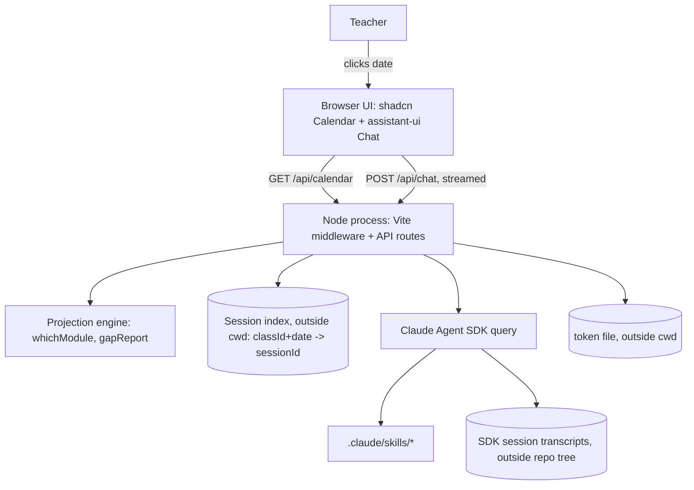

# Local Teacher Companion (Calendar + Chat) - Plan

## Goal Capsule

- **Objective:** give the teacher local, conversational access to lesson planning
  (Component O's interface) without requiring their own Claude Code/IDE setup, paired
  with a live calendar view of the projected year.
- **Product authority:** `docs/spec/00-overview.md`'s Component O interface note
  ("the teacher works through conversation with O, not a web app") and roadmap Phase 2
  — reopened here at the teacher's request, since the target teacher can't set up a CLI.
- **Stop conditions:** stop and re-raise to the user if the Agent SDK's write-blocking
  guarantee (KTD2) cannot actually be verified in a test — R8's read-only promise is
  load-bearing and must not ship unproven.
- **Execution profile:** standard code implementation (`execution: code`); no live
  Agent SDK calls in the automated test suite (mock at the module boundary) so test
  runs don't consume the teacher's subscription usage.
- **Tail ownership:** one PR covering all units is fine given the units are tightly
  coupled (server + UI for one feature); a human performs the manual smoke test in
  Definition of Done before merge, since the live Agent SDK path has no CI coverage.

## Product Contract

### Summary

A new local-only component pairs a live calendar view with an embedded chat tab,
backed by a local dev server and the Claude Agent SDK. Clicking a date seeds a chat
session with that date's projection and coverage context and the repo's existing
skills; each date's conversation persists across sessions. A single Node process
(Vite in middleware mode) serves the UI and API on one origin; the read-only guarantee
is enforced with an explicit tool deny-list; the one-time subscription auth step
writes to a local file the server reads at startup, not a shell environment variable.

### Problem Frame

Component O (`prepare-lesson`, §4.6) is specced as the primary interface, but assumes
the teacher runs it via their own Claude Code session — nothing has been built to
deliver that conversation to a teacher who can't or won't set up a CLI. Meanwhile
Component F (§4.1) is explicitly a static, read-only, no-backend calendar and
explicitly not an authoring IDE. Neither one, as specced, gives this teacher a way to
just click a date and start planning.

### Requirements

**Calendar & context**

- R1. The companion shows a calendar view of the projected year (module, phase,
  milestone/test dates, coverage gaps) computed directly from the Phase-1 projection
  engine against the live repo data. **Superseded by R11** (2026-07-26): all classes
  (grades 5/6/7) show simultaneously as toggleable overlay layers in one calendar,
  not one class at a time.
- R2. Clicking a date opens a chat tab seeded with that date's context: active module,
  week-in-module, and phase (`whichModule`), coverage gaps for the active module
  (`gapReport`), and the existing `lesson-spec.json`/artifacts for that date when
  present. **Amended by R11** (2026-07-26): since a date cell can now hold multiple
  grades' modules at once, the click target moved from "the date cell itself" to a
  per-date "Plan lesson" affordance that first asks which grade, then opens chat
  seeded exactly as R2 originally specified.
- R3. The chat session has access to the repo's existing skills (`curriculum-decompose`,
  `module-derive`, `vocab-generate`, and any future `prepare-lesson`/generator skills)
  exactly as under Claude Code, with no separate configuration. Skill tool-calls that
  write files are disabled for this session — R8's read/advisory-only guarantee
  covers skill-triggered writes, not just direct edits.

**Chat session**

- R4. Chat runs as a live Claude Agent SDK session inside a local Node dev server, not
  a raw CLI shell-out. The server binds to `127.0.0.1` only, validates the
  request's Origin against the served UI's own origin, and requires a per-session
  token on the chat endpoint, so another site open in the same browser cannot
  address it.
- R5. The session authenticates against the teacher's Claude Pro/Max subscription
  (via a one-time `claude setup-token`-style step) rather than a separate pay-per-token
  API key. Confirmed: the Agent SDK supports subscription-based auth through a
  dedicated token pool (not the CLI's own OAuth session) as of mid-2026. The
  resulting token is stored with restrictive OS file permissions, never logged or
  written into the repo tree.
- R9. The one-time `claude setup-token` step is documented as an install
  requirement in `README.md`, performed once during machine setup — not part of
  the teacher's ongoing lesson-planning workflow. Resolves the apparent
  contradiction between "teacher can't set up a CLI" and R5's own auth mechanism:
  the CLI touches setup once, never day-to-day use.

**Persistence**

- R6. Each date's conversation persists, keyed by class and date, using the Agent
  SDK's native session-resume mechanism, so reopening that date resumes the prior
  conversation.
- R7. Session data is excluded from version control so draft lesson content never
  risks reaching the public repo: stored under a path covered by an explicit
  `.gitignore` entry, verified not already tracked (or stored outside the repo
  tree entirely), not left to an unenforced convention.
- R8. The chat session is read/advisory-only: it discusses and proposes plan or
  lesson changes in conversation, but does not write to repo files
  (`modules.yaml`, `lesson-spec.json`, etc.) itself. File edits stay a teacher
  action until `prepare-lesson` (O) exists to own writes.
- R10. The web app detects whether it is being served by the companion's own
  local server (via the per-session token handshake, KTD9) on load. If that
  handshake fails or is absent — e.g. the built frontend is ever served
  statically, such as by an accidental future GitHub Pages deploy alongside
  Component F's separate static site — the Chat tab renders disabled with an
  explanatory message instead of a broken/inert chat UI; the Calendar still
  attempts to render from whatever `/api/calendar` data is reachable. UX-only
  safeguard: R4/R7/R8's actual security guarantees (origin check, token
  requirement, deny-list) do not depend on this and are unaffected either way.
- R11. **Multi-grade overlay calendar with module-spanning tasks** (added
  2026-07-26, supersedes R1's single-class framing, amends R2/F1-F4). Raised by the
  teacher after seeing U4's first working build: the specific per-weekday lesson
  slots (Mon/Wed/Fri) rendered by that build were a placeholder assumption, not real
  data — the projection engine only ever computed a module's overall date-range
  budget, never a specific day-of-week pattern. Reframes the calendar accordingly:
  - All classes (`plans/*/class.yaml`) render simultaneously in one calendar; the
    color legend (previously per-module) becomes per-class/grade groups, toggleable
    via the same CalendarPanel mechanism U4 already built.
  - Each module becomes one spanning task/appointment (start = its placement's
    first slot date, end = its last slot date), not one event per specific weekday.
  - Hovering or clicking a module task shows its planned detail, including existing
    `lesson-spec.json` artifacts already landed within its date range.
  - Hovering a specific day shows a "Plan lesson" button (repurposing the calendar
    framework's native add-affordance rather than a bespoke overlay); clicking it
    opens a small form asking which grade the lesson is for (a day can now span
    multiple grades' modules at once), then opens the chat tab seeded exactly as R2
    specifies — a routing step only: no file writes, stays inside R8's
    read/advisory-only boundary and the plan's own "`prepare-lesson` (O) is out of
    scope" boundary.
  - Day/week/month view switching (the calendar framework's built-in views) ships;
    Timeline/Resources/Agenda/Year views are confirmed PRO-only in the installed
    open-source `@svar-ui/react-calendar` edition (verified via its docs during U4)
    and are not available without a paid license — explicitly out of scope, not a
    gap.

### Key Decisions

- **Full embedded chat over a copy-prompt button or a plain terminal session.**
  Three options were weighed: (1) the teacher runs `claude` directly in the repo
  today — zero new code, but requires the CLI setup the premise says is the
  blocker; (2) a copy-seeded-prompt button — F stays fully static, teacher pastes
  into their own Claude session; (3) full embedded chat. Chosen: full embedded
  chat, accepting local-server and SDK complexity now in exchange for a session
  the teacher never has to open a terminal or manually copy context into.
- **Local-only component adds a live-network dependency; the spec's "offline-first,
  dependency-light" principle (`docs/spec/00-overview.md`) is scoped to the
  published artifact pipeline (Components F/I), not this local tool.** The new
  Agent SDK dependency still needs the same permissive-license check the spec
  requires for third-party libraries before it lands in `package.json`.
- **Ships as infrastructure only, decoupled from prepare-lesson/G/H.** None of Phase
  3's generation skills exist yet; this component works with whatever skills exist
  today and gains capability automatically as Phase 3 lands, with no UI changes.
  Day-one chat is limited to what `curriculum-decompose`/`module-derive`/
  `vocab-generate` can do — an accepted starting point, not a blocker.
- **UI framework: shadcn/ui (calendar + light/dark theming) + assistant-ui (chat
  primitives), wired to the Agent SDK via a custom runtime adapter.** shadcn/ui
  (React + Tailwind + Radix, MIT) ships a themeable Calendar component with
  light/dark mode built in. assistant-ui (MIT) ships Thread/Message/Composer/
  ThreadList primitives with streaming, markdown, and a shadcn/ui-matched theme.
  Verified 2026-07-25: neither ships a first-class Claude Agent SDK adapter —
  assistant-ui's backend integrations are Vercel AI SDK, LangGraph, and a custom
  data-stream runtime, not Anthropic-specific — so the Agent SDK connection is
  custom-built regardless of UI framework choice. This is a real new dependency
  (React/Tailwind/Radix) this repo doesn't carry elsewhere; scoped to this
  local-only component, not the static public site (Component F).
- **New local-only component; Component F stays untouched.** F's static,
  no-backend, GitHub-Pages design (§4.1/§4.7) stays exactly as specced — this is a
  separate local tool for the teacher's own machine, not a public deployment.
- **Read/advisory-only, no file writes.** The chat proposes changes in conversation;
  the teacher still applies them by hand. Keeps this component's scope honest
  (infrastructure, not O) and avoids an unreviewed write landing in the plan.

### Actors

- A1. **Teacher** — browses the year, clicks dates, converses about planning and
  lessons.
- A2. **Local companion server** — Node process running the Agent SDK; computes
  calendar/coverage context from the Phase-1 projection engine and serves the browser
  UI.
- A3. **Claude Agent SDK session** — the conversational agent, loaded with the repo's
  `.claude/skills/*` (and a `CLAUDE.md`, once one is authored — none exists in this
  repo today), one session per class + date.

### Key Flows

- F1. **Open an existing lesson's date**
  - **Trigger:** teacher clicks a date with an existing `lesson-spec.json`/artifacts.
  - **Steps:** server loads that date's projection context, existing artifacts, and
    saved session history (if any) -> seeds/resumes the chat session -> teacher
    converses to review or modify.
  - **Covers:** R2, R3, R6.
- F2. **Open a new date**
  - **Trigger:** teacher clicks a date with no existing lesson.
  - **Steps:** server loads projection and coverage-gap context for that date -> seeds
    a fresh chat session -> teacher converses to plan.
  - **Covers:** R2, R3, R6.
- F3. **Switch dates mid-conversation**
  - **Trigger:** teacher clicks date B while date A's chat is still active.
  - **Steps:** UI asks the teacher to confirm before switching (date A's
    conversation is already safe via R6's session-resume, same as starting a new
    CLI session) -> on confirm, date A's chat closes and F1/F2 runs for date B.
  - **Covers:** R2, R6.
- F4. **Click a holiday or non-teaching day**
  - **Trigger:** teacher clicks a date with no active module (holiday, weekend,
    other non-teaching day).
  - **Steps:** UI shows an inline message that the date is a holiday/non-teaching
    day; no chat session opens.
  - **Covers:** R1.

### Scope Boundaries

- Authoring `prepare-lesson` (O), the lesson generator (G), or exercise-type skills
  (H) — Phase 3 work; this component just gives them a delivery surface once they
  exist.
- Any production or multi-teacher deployment — this is a single-teacher local tool,
  not hosted anywhere.
- Syncing a date's conversation history across machines (school desktop vs. home
  laptop) — each machine's session index and Agent SDK transcripts are independent;
  no sync mechanism ships in this component (R6/R7).

#### Deferred to Follow-Up Work

- Seeding a date's chat context with full-year milestone/gap context, not just
  the active module's. The calendar (R1) already surfaces upcoming milestones
  and gaps across the year; the chat (R2) currently seeds only the active
  module's gap report, so the agent doesn't see test pressure the teacher can
  see on the calendar. Cheap to add later once the day-one scope has shipped.

### Dependencies / Assumptions

- Depends on the Phase-1 projection engine (`whichModule`, `gapReport`) being
  importable as TS functions from a Node server process — already true
  (`src/projection/query.ts`, `src/coverage/gapReport.ts`).
- Assumes the Claude Agent SDK can run a session scoped to this repo's working
  directory so `.claude/skills/*` loads the same way it does under the Claude Code
  CLI. No `CLAUDE.md` exists in this repo yet; one may need to be authored for the
  session to carry repo-level instructions the way Claude Code sessions normally do.
- Assumes the teacher's machine has (or can complete) a one-time `claude
  setup-token`-style step so the Agent SDK can draw on their Claude Pro/Max
  subscription — documented as a `README.md` install requirement (R9).
- Depends on shadcn/ui and assistant-ui (both MIT, verified 2026-07-25) and
  their underlying React/Tailwind/Radix stack — new dependencies this repo
  doesn't carry elsewhere, scoped to this local-only component.

### Sources / Research

- `docs/spec/00-overview.md` — component map and the Component O interface note this
  brainstorm reopens.
- `docs/spec/03-generation.md` §4.1 (Component F), §4.5-4.7 (end-to-end flow, the
  `prepare-lesson` orchestrator, static-site delivery).
- `docs/plans/2026-07-25-001-feat-phase1-projection-coverage-engine-plan.md` — the
  projection engine this component depends on.
- shadcn/ui changelog (chat components, June 2026) and `assistant-ui/assistant-ui`
  (GitHub) — verified 2026-07-25 for UI framework choice: both MIT, calendar +
  light/dark theming confirmed in shadcn/ui, chat primitives + streaming
  confirmed in assistant-ui, no first-class Claude Agent SDK adapter in either.
- Claude Agent SDK docs, "Work with sessions" (`code.claude.com/docs/en/agent-sdk/sessions`)
  — verified 2026-07-25: `resume` takes an explicit session ID (`continue` only
  finds the most recent session in a directory); sessions persist to
  `~/.claude/projects/<encoded-cwd>/<session-id>.jsonl` by default; resuming across
  machines requires mirroring that file or a custom `SessionStore`.
- Claude Code authentication docs (`code.claude.com/docs/en/authentication`) —
  verified 2026-07-25: `claude setup-token` mints a one-year OAuth token tied to a
  Pro/Max/Team/Enterprise subscription, prints it once (does not save it), and it's
  consumed via the `CLAUDE_CODE_OAUTH_TOKEN` environment variable; `ANTHROPIC_API_KEY`
  outranks it in the SDK's auth precedence if both are present.
- `anthropics/claude-agent-sdk-typescript` issue #115 — verified 2026-07-25:
  `allowedTools` alone does not block built-in Edit/Write/Bash tool calls; an
  explicit `disallowedTools` deny rule is required to guarantee a read-only session
  (load-bearing for R8, KTD2).
- assistant-ui docs, "Custom Runtime" / "ExternalStoreRuntime" — verified
  2026-07-25: `useExternalStoreRuntime` is the documented pattern for bridging a
  custom backend's message stream into assistant-ui's runtime, used since neither
  shadcn/ui nor assistant-ui ships a first-class Agent SDK adapter.

---

## Planning Contract

Product Contract unchanged from the brainstorm. All five items previously listed
under "Deferred to Planning" are resolved below via SDK research and closed out —
none remain open, so no separate Outstanding Questions section is carried forward.

### Key Technical Decisions

- **KTD1. Single Node process, Vite in middleware mode, serves both UI and API.**
  One process mounts the built React UI and the `/api/calendar` and `/api/chat`
  routes on the same origin/port. Satisfies R4's same-origin requirement without a
  reverse proxy and avoids a second server-framework dependency beyond what
  shadcn/ui and assistant-ui already require (React/Vite tooling). Alternative
  considered: a separate Express/Fastify API server behind a Vite dev-server proxy
  — rejected, adds a second process and origin-matching plumbing for no benefit at
  this scale.
- **KTD2. Write-blocking enforced with an explicit `disallowedTools` deny-list, not
  `allowedTools` alone.** Verified via the SDK's issue tracker (2026-07-25):
  `allowedTools` does not prevent Claude from invoking built-in `Edit`/`Write`/
  `Bash`/`MultiEdit`/`NotebookEdit` tools — only explicit deny rules do. This is
  load-bearing for R8's read-only guarantee, including R3's carve-out for
  skill-triggered writes.
- **KTD3. Session resume keyed by an explicit local index, `{classId, date} ->
  sessionId`, using the SDK's `resume` option (not `continue`).** The SDK's own
  session store is not natively keyed by class+date; the server owns this mapping
  and passes the stored ID to `resume` when one exists, omitting it to start a
  fresh session otherwise.
- **KTD4. `cwd` set to the repo root and `settingSources: ["user", "project"]` on
  every query.** Confirmed via SDK docs: skills under `.claude/skills/*` do not
  load without `settingSources`, even with `Skill` in `allowedTools`. Required for
  R3's "exactly as under Claude Code" guarantee.
- **KTD5. The one-time `claude setup-token` output is pasted by the teacher into a
  local file, outside the Agent SDK's readable `cwd` scope (KTD6) — not exported
  as a shell environment variable.** The server reads that file at startup and
  sets `process.env.CLAUDE_CODE_OAUTH_TOKEN` for its own process only. Because
  "restricted to owner read/write" is a claim someone has to enforce, the server
  itself sets the file mode explicitly (owner-only) whenever it writes or
  rotates the token, and warns at startup if the file's current permissions
  look broader than that — best-effort, phrased platform-agnostically rather
  than a guarantee, since POSIX permission bits don't hold the same meaning on
  every filesystem (R5). Matches R9: the CLI is touched once at setup, never
  for day-to-day use. Edge case surfaced by research: if `ANTHROPIC_API_KEY` is
  already set in the teacher's environment, it silently outranks the OAuth
  token in the SDK's auth precedence and the session would bill pay-per-token
  API usage instead of the subscription — the server detects and warns on this
  at startup (U1).
- **KTD6. Companion-local state (session index, cached token) lives outside the
  Agent SDK's readable `cwd` scope entirely** — a *local-only* OS user-config
  directory (e.g. an XDG-style path on Linux, `%LOCALAPPDATA%` rather than a
  roaming/cloud-backed folder on Windows, avoiding `~/Library/Mobile Documents`
  on macOS — see Risks & Dependencies for why "local-only" is load-bearing),
  not a repo-root subdirectory. This is stronger than gitignoring a repo-root folder:
  KTD4 sets `cwd` to the repo root and KTD2/KTD10's deny-list only blocks
  `Edit`/`Write`/`MultiEdit`/`NotebookEdit`/`Bash` — `Read` is never denied, so
  anything living inside `cwd` is readable by the chat session itself,
  including a teacher-triggered "list files here" or a skill that enumerates
  the directory. Placing the token and session index outside `cwd` closes that
  path structurally rather than relying on the agent never being asked to look.
  Satisfies R7's "stored outside the repo tree entirely" branch directly, with
  no reliance on an unenforced gitignore convention.
- **KTD7. Multi-class navigation is a simple class-switcher control**, sourced from
  the existing `plans/grade-*/class.yaml` files already in the repo. Switching
  classes re-scopes the calendar; session keys already carry `classId`, so no
  session-index changes are needed to support it.
- **KTD8. A blocked skill-triggered write degrades gracefully in-conversation,
  rather than failing opaquely.** `module-derive`/`vocab-generate` normally write
  draft YAML as their output; with KTD2's deny-list in place, that write is
  denied. The SDK's deny path returns the denial as a normal tool result the
  agent can react to in the same turn, not a hard process failure — so the
  agent explains what it would have written and the teacher copies it manually,
  honoring R3's "exactly as under Claude Code" access alongside R8's read-only
  guarantee rather than contradicting it. This needs verifying, not building
  (U1).
- **KTD9. Chat-endpoint authentication is specific about what it does and does
  not defend against.** Origin comparison is exact-string match, not a
  suffix/substring check (defeats DNS rebinding); the per-session token is
  delivered as a header or request-body value the browser never attaches
  automatically, never an auto-sent cookie (avoids reintroducing CSRF). A
  browser extension holding host permissions on `127.0.0.1` is an accepted,
  unmitigated residual risk for this local single-teacher tool — named
  explicitly rather than implied covered by R4 (U3).
- **KTD10. The `disallowedTools` deny-list (KTD2) is the only enforcement
  mechanism — pairing it with an `allowedTools` allow-list does NOT add
  defense-in-depth, despite that being the original intent here.** KTD2's own
  cited research (the SDK issue tracker) shows `allowedTools` doesn't gate
  built-in tool calls at all, so an allow-list adds no protection against a
  built-in tool the deny-list misses. The real backstop against a future SDK
  release adding an unlisted write-capable built-in is version-pinning the
  Agent SDK dependency and treating every version bump as a reviewed change
  that re-checks the deny-list against that version's built-in tool list, not
  an automatic upgrade.
- **KTD11. Frontend TypeScript uses a separate `tsconfig.web.json`, not the
  existing root `tsconfig.json`.** The root config has no `jsx` option, no
  `lib` (so no DOM types), and an `include` glob (`src/**/*.ts`) that doesn't
  match `.tsx` files at all — as-is, `npm run build` would either skip the new
  React components or fail to compile them. `tsconfig.web.json` extends the
  root config, adding `jsx: react-jsx`, `DOM`/`DOM.Iterable` to `lib`, and an
  `include` covering `src/companion/web/**/*.tsx`, keeping DOM types out of the
  server/CLI code's NodeNext-oriented config.

### High-Level Technical Design

---

## Risks & Dependencies

- **Token file exposure via loose permissions.** The one-year OAuth token grants
  full subscription access; a permissive umask or a non-POSIX filesystem could
  leave it more widely readable than intended. **Mitigation:** the server sets
  the file mode explicitly (owner-only) on write and warns at startup if current
  permissions look broader — best-effort, not a cross-platform guarantee (KTD5).
- **The chat session reading its own token or session state.** The deny-list
  (KTD2/KTD10) blocks write tools but never `Read`; if the token file or
  session index lived inside the Agent SDK's `cwd`, the agent could read its
  own credential — accidentally (a teacher asking it to "list files here") or
  via a skill that enumerates the directory. **Mitigation:** KTD6 places both
  outside `cwd` entirely, closing the path structurally rather than trusting
  the agent is never asked to look.
- **Deny-list falling out of date.** A future Agent SDK release could add a new
  write-capable built-in tool the `disallowedTools` list doesn't name, silently
  reopening R8's read-only guarantee. **Mitigation:** pin the SDK dependency
  version and treat every bump as a reviewed step that re-checks the deny-list
  against the new version's built-in tool list — an `allowedTools` allow-list
  does not add protection here, since `allowedTools` doesn't gate built-in
  tools at all (KTD10).
- **Write-block guarantee is unproven by the default test suite.** `npm test`
  mocks the Agent SDK, so it proves the wrapper *configures* the deny-list
  correctly but not that a live session actually honors it — the single most
  safety-critical guarantee in this plan otherwise rests on one manual smoke
  test. **Mitigation:** an opt-in, non-CI live-SDK regression test, documented
  and run occasionally (it consumes real subscription usage), is the durable
  proof beyond the manual check (see Verification Contract).
- **KTD1's core mechanism is unverified.** Unlike this plan's other Key
  Technical Decisions, KTD1 (single-process Vite-middleware mode serving both
  the UI and a streamed API route on one origin) has no cited source
  confirming Vite middleware mode supports a streamed `POST` route this way —
  it rests on framework familiarity, not a verified reference. **Mitigation:**
  U3's execution note already front-loads a failing integration test for this
  exact contract before the rest of the server is built, so a wrong assumption
  surfaces at the start of U3, not after the UI is built on top of it.
- **OS-level backstop for the write-block guarantee was considered and not
  taken.** KTD2/KTD10 enforce read-only access entirely inside the Agent SDK's
  own tool-gating layer; an OS-level backstop (a restricted OS user, a
  read-only bind mount for the session) would be a stronger structural
  guarantee but is disproportionate for a single-teacher local tool.
  **Mitigation:** the opt-in live-SDK regression test (Verification Contract)
  is the accepted verification layer instead of OS-level sandboxing.
- **Token/session-state directory could be cloud-synced off the machine.** KTD6
  moves the token and session index to an OS user-config directory, but on
  Windows (OneDrive Known Folder Move) or macOS (iCloud Drive), the
  platform-equivalent config location can be transparently synced to a
  third-party cloud service — exfiltrating the one-year OAuth token off the
  local machine entirely, a worse outcome than the git-leak scenario R7 guards
  against. **Mitigation:** the implementation must resolve a *local-only*
  platform path (e.g. `%LOCALAPPDATA%` rather than a roaming or cloud-backed
  folder on Windows; avoid `~/Library/Mobile Documents` on macOS), not assume
  any user-config directory is safe by default.
- **Auth-boundary residual risk: browser extensions.** Origin validation plus a
  per-session token defeats a malicious same-browser tab and DNS rebinding, but
  not a browser extension holding host permissions on `127.0.0.1`.
  **Mitigation:** accepted as an unmitigated residual risk for this local
  single-teacher tool, named explicitly rather than implied covered by R4
  (KTD9).
- **New, unfamiliar dependency surface.** The Agent SDK, shadcn/ui, and
  assistant-ui are all new to this repo with no prior integration experience to
  draw on; behavior gaps (the `allowedTools` gap behind KTD2 is one example)
  are more likely to surface during implementation than planning.
  **Mitigation:** U1 sequences the highest-risk integration (write-blocking)
  before the rest of the server, so a gap surfaces early rather than after the
  UI is built on top of it.

---

## Implementation Units

### U1. Agent SDK session engine

- **Goal:** wrap the Agent SDK `query()` call with session resume, `cwd`/
  `settingSources`, deny-list enforcement, and OAuth-token loading so any date's
  chat runs against the repo's skills, read-only.
- **Requirements:** R3, R4, R5, R6, R7, R8, R9 (KTD2, KTD3, KTD4, KTD5, KTD6)
- **Dependencies:** none (foundational)
- **Files:** `src/companion/server/agentSession.ts`, `src/companion/server/authToken.ts`,
  `src/companion/server/sessionIndex.ts`, `src/companion/server/agentSession.test.ts`,
  `src/companion/server/authToken.test.ts`, `src/companion/server/sessionIndex.test.ts`
- **Approach:** `authToken.ts` reads the token file at startup (KTD6: an OS
  user-config directory, outside the Agent SDK's `cwd`) and sets
  `process.env.CLAUDE_CODE_OAUTH_TOKEN`, warning if `ANTHROPIC_API_KEY` is
  already present. `sessionIndex.ts` persists `{classId, date} -> sessionId` as
  JSON in that same outside-`cwd` companion-state directory. `agentSession.ts` wraps
  `query()` with `cwd`, `settingSources`, the `disallowedTools` deny-list, and
  `resume: <stored id>` when one exists; captures the resulting `session_id` from
  the result message and writes it back to the index.
- **Test scenarios:**
  - Happy path: a new class+date with no prior session calls `query()` without
    `resume`; the returned `session_id` is persisted to the index.
  - Happy path: an existing class+date calls `query()` with `resume: <stored id>`.
  - Edge: two different dates for the same class produce two distinct index
    entries and never collide.
  - Edge: `disallowedTools` includes `Edit`/`Write`/`MultiEdit`/`NotebookEdit`/
    `Bash` on every query call — this is a config-level assertion; it does not
    by itself prove a live SDK session honors the deny-list (see the
    Verification Contract's live-SDK-gated check).
  - Happy path (agent-native): a denied write tool-result is returned to the
    agent mid-conversation and the conversation continues rather than
    terminating (mock a deny result), proving the write-block degrades
    gracefully instead of hard-failing (KTD8).
  - Edge: `cwd` and `settingSources` are always passed on every call (assert exact
    option values).
  - Error path: a missing or unreadable token file fails server startup with a
    clear message rather than silently proceeding without auth.
  - Error path: a present-but-expired OAuth token fails at query time (not
    startup) with a clear message telling the teacher to re-run
    `claude setup-token` — the token is valid for one year, not indefinitely,
    so R9's "one-time setup" framing needs an expiry recovery path.
  - Edge: two overlapping requests for the same `{classId, date}` key (e.g. two
    browser tabs) do not silently corrupt the index — the second request
    either serializes behind the first or is rejected with a clear error,
    never a silent last-write-wins overwrite of the other conversation's
    session id.
  - Edge: a stored session id whose SDK transcript is missing or corrupted
    starts a fresh session (with a notice that prior history was lost) instead
    of surfacing a raw SDK error.
  - Edge: the token file's mode is set to owner-only when the server writes it,
    and a startup warning fires if existing permissions are broader than that
    (KTD5).
  - Edge: `ANTHROPIC_API_KEY` present in the process env at startup produces a
    warning (KTD5).
  - Edge: the token file and session index resolve to a path outside `cwd`
    (assert the resolved path is not a descendant of the repo root passed as
    `cwd`), so the chat session's own `Read` tool cannot reach them (KTD6).
- **Verification:** unit tests with the Agent SDK mocked at the module boundary;
  no live SDK calls in the test suite.

### U2. Date context assembly

- **Goal:** given a class + date, assemble the seed context (`whichModule`,
  `gapReport`, existing `lesson-spec.json`/artifacts if present) that primes a new
  or resumed chat session, and detect non-teaching days.
- **Requirements:** R1, R2, F1, F2, F4
- **Dependencies:** none (wires into U1's seeding call)
- **Files:** `src/companion/server/dateContext.ts`, `src/companion/server/dateContext.test.ts`,
  `src/companion/server/buildLedger.ts`, `src/companion/server/buildLedger.test.ts`
- **Approach:** reuse `whichModule` (`src/projection/query.ts`) and `gapReport`
  (`src/coverage/gapReport.ts`) directly; load the class's `modulesFile` the
  same way existing CLI tooling does (`src/cli/validateAll.ts`). Building
  `placements` and the `CoverageLedger` from real class data is new plumbing,
  not reuse — no existing CLI entrypoint constructs either from real delivered
  lessons today, so `buildLedger.ts` scans `artifacts/<class>/**/lesson-spec.json`
  into `LessonCoverage[]` and calls `coverageLedger` (`src/coverage/ledger.ts`).
  Probe for an existing `lesson-spec.json`/artifacts for the date and include a
  reference when present.
- **Test scenarios:**
  - Happy path: a date with an active module returns `moduleId`, `weekInModule`,
    `phase`, and that module's current gap-report entries.
  - Happy path: a date with an existing `lesson-spec.json` includes a reference to
    it in the assembled context (F1).
  - Edge: a date with no lesson-spec yet returns context with no artifact
    reference (F2).
  - Edge: a holiday/non-teaching date (`whichModule` returns `moduleId: null`) is
    flagged distinctly so the caller can skip opening a chat session (F4).
  - Integration: a date near a milestone includes the at-risk gap classification
    from `gapReport`, not just uncovered/under-depth.
  - Edge: a class with zero or near-zero `lesson-spec.json` artifacts on disk
    (the day-one state, before Phase 3's generation skills exist) builds an
    empty-but-valid `CoverageLedger` rather than erroring.
- **Verification:** unit tests against fixture class/plan data, mirroring the
  existing `src/coverage/fixtures`/`src/projection/fixtures` conventions.

### U3. HTTP layer: local server, security, and API routes

- **Goal:** one Node process (Vite middleware mode) serving the built UI and two
  API routes — `GET /api/calendar` and `POST /api/chat` (streamed) — with origin
  validation and a per-session token.
- **Requirements:** R1, R4 (KTD1)
- **Dependencies:** U1, U2
- **Files:** `src/companion/server/index.ts`, `src/companion/server/security.ts`,
  `src/companion/server/routes/calendar.ts`, `src/companion/server/routes/chat.ts`,
  `src/companion/server/security.test.ts`, `src/companion/server/routes/calendar.test.ts`,
  `package.json`
- **Approach:** bind to `127.0.0.1` only; validate the request's `Origin` header
  against the server's own served origin on every request; issue a per-session
  token on initial UI load and require it on `/api/chat`; stream the Agent SDK's
  turn-by-turn output to the client for the frontend runtime adapter (U5) to
  consume.
- **Execution note:** start with a failing integration test for the `/api/chat`
  request/response contract (origin + token enforcement) before wiring the
  streaming happy path — this is the security-load-bearing boundary (R4).
- **Test scenarios:**
  - Happy path: a request from the served UI's own origin with a valid session
    token succeeds.
  - Error path: a request with a missing/wrong `Origin` header is rejected (403)
    before the Agent SDK is invoked.
  - Edge: Origin comparison is exact-string match — a lookalike/subdomain
    Origin (not just a missing or obviously-wrong header) is rejected too
    (KTD9).
  - Error path: a request with a missing/invalid per-session token is rejected
    (401).
  - Edge: the per-session token is read from a header or request body, never
    accepted via an automatically-sent cookie (KTD9).
  - Edge: the server refuses to bind to any interface other than `127.0.0.1`
    (assert listen options).
  - Integration: `GET /api/calendar` for a date range returns
    `whichModule`/`gapReport`-derived data shaped for the calendar UI (module id,
    phase, gap severity per date).
  - Integration: `POST /api/chat` streams incremental assistant output, not a
    single buffered response.
- **Verification:** integration tests spin up the server on an ephemeral port and
  issue real HTTP requests against it, with the Agent SDK module mocked.

### U4. Frontend: calendar view

- **Goal:** render the projected year (shadcn/ui Calendar) colored/annotated by
  module, phase, milestone/test dates, and coverage gaps, sourced from
  `GET /api/calendar`; clicking a date opens the chat tab or, for non-teaching
  days, an inline message.
- **Requirements:** R1, F4 (KTD11)
- **Dependencies:** U3
- **Files:** `src/companion/web/Calendar.tsx`, `src/companion/web/Calendar.test.tsx`,
  `src/companion/web/api.ts`, `package.json`, `tsconfig.web.json`,
  `vitest.config.ts`
- **Approach:** add `tsconfig.web.json` (KTD11) so the new `.tsx` files
  typecheck under `npm run build`, and a `vitest.config.ts` entry scoping a
  jsdom/happy-dom test environment to `src/companion/web/**` so U4-U6's
  component tests can run. shadcn/ui's themeable Calendar component as the grid; per-day
  styling driven by the API response's module/phase/gap-severity fields;
  `onSelect` dispatches to either "open chat for date" or "show non-teaching-day
  message" depending on the day's `moduleId`.
- **Test scenarios:**
  - Happy path: a day with an active module renders with that module's
    color/label.
  - Happy path: clicking a day with an active module triggers the "open chat"
    callback with the correct date.
  - Edge: a day with a coverage gap shows a distinct visual indicator per gap
    kind (uncovered/under-depth/at-risk).
  - Edge: clicking a holiday/non-teaching day shows the inline message and does
    not trigger "open chat" (F4).
  - Edge: light/dark theming renders both without layout breakage.
- **Verification:** component tests with mocked API responses; visual check in a
  running dev server for theming.

### U5. Frontend: chat tab

- **Goal:** assistant-ui Thread/Message/Composer wired to `POST /api/chat` via a
  custom `useExternalStoreRuntime` adapter that streams responses; date-seeded on
  open; confirms before switching dates mid-conversation.
- **Requirements:** R2, R3, F1, F2, F3, R10
- **Dependencies:** U3, U4
- **Files:** `src/companion/web/Chat.tsx`, `src/companion/web/runtime.ts`,
  `src/companion/web/Chat.test.tsx`
- **Approach:** `useExternalStoreRuntime` owns the message array and bridges
  `POST /api/chat`'s stream into assistant-ui's message format (the documented
  external-store pattern, since neither shadcn/ui nor assistant-ui ships a
  first-class Agent SDK adapter); opening a date seeds the first turn with U2's
  assembled context; a confirm dialog gates switching to a different date while a
  session is active, after which the prior date's conversation stays resumable
  via R6. Accepts a `serverAvailable` prop (owned/computed by U6's App shell per
  R10) and renders disabled with an explanatory message when false, instead of
  attempting to open a chat session against a server that isn't there.
- **Test scenarios:**
  - Edge: `serverAvailable: false` renders the tab disabled with an explanatory
    message and never attempts to open a chat session (R10).
  - Happy path: opening a date with no prior session starts a fresh seeded
    conversation (F2).
  - Happy path: opening a date with a prior session resumes it with history
    intact (F1).
  - Happy path: a sent message's streamed response renders incrementally.
  - Edge: switching to a new date while a conversation is active shows a confirm
    dialog before closing the current chat (F3).
  - Edge: canceling the switch-date confirmation leaves the current chat open and
    unaffected.
  - Error path: a failed/interrupted stream surfaces a visible error state
    rather than silently hanging.
- **Verification:** component tests with a mocked streaming fetch; manual
  run-through in the dev server for the confirm-dialog flow.

### U6. App shell: class switcher and end-to-end wiring

- **Goal:** top-level app composing U4 + U5, plus a class switcher (KTD7) sourced
  from existing `class.yaml` files, so F1-F4 work end-to-end for grades 5/6/7.
- **Requirements:** R1, R2, F1, F2, F3, F4, R10 (KTD7)
- **Dependencies:** U4, U5
- **Files:** `src/companion/web/App.tsx`, `src/companion/web/ClassSwitcher.tsx`,
  `src/companion/web/ClassSwitcher.test.tsx`
- **Approach:** read available classes from `plans/grade-*/class.yaml` at server
  startup and expose via a small API or build-time data load; switching classes
  re-scopes the calendar to that class's plan/calendar data; the active class +
  date together form the session key used throughout U1-U3. On mount, App.tsx
  performs the R10 server-presence handshake (attempts the per-session token
  fetch from U3's security layer) and passes the resulting `serverAvailable`
  boolean down to U5's Chat tab; a failed/absent handshake never blocks the
  Calendar from rendering.
- **Test scenarios:**
  - Happy path: switching the class dropdown re-renders the calendar for the
    newly selected class's modules/gaps.
  - Edge: switching classes while a chat is open follows the same F3
    confirm-before-switch behavior as switching dates.
  - Integration: an end-to-end (server + UI) run-through of F1 (existing
    lesson-spec date) and F2 (new date) for one grade-5 class, using real fixture
    data.
  - Edge: when the token handshake fails (simulated), the Calendar still renders
    and the Chat tab shows disabled (R10).
- **Verification:** component test for the switcher; one integration-level test
  exercising the real API layer against fixture class data (Agent SDK still
  mocked).

#### Amendment (2026-07-26, R11): concrete implementation shape

Supersedes the Approach text above for U2-U4 and U6. U5's chat-seeding contract
(R2/F1-F3/R6) is unaffected — only how a date+grade gets selected changes.

- **U2 (`dateContext.ts`/new `moduleTasks.ts`):** add a `moduleTasks(params: {
  from, to, repoRoot? })` function (no `class` param — scans every
  `plans/*/class.yaml`) returning one `ModuleTask` per module placement whose
  slot range overlaps `[from, to]`: `{ classId, classLabel, moduleId,
  moduleTitle, startDate, endDate, gaps, plannedDates: string[] }` —
  `moduleTitle` from `Module.title` (`schema/types.ts`, already on every module,
  previously unused by this component); `plannedDates` from the same
  `artifacts/<class>/**/lesson-spec.json` scan `buildLedger.ts` already does,
  filtered to dates inside `[startDate, endDate]`. `dateContext.ts` itself
  (single class + date, used to seed a chat session once a grade+date is
  chosen) is unchanged.
- **U3 (`routes/`):** add `GET /api/tasks?from=&to=` returning `{ classes:
  {id, label}[], tasks: ModuleTask[] }` for all classes in range. The existing
  `GET /api/calendar` (per-class, per-day) stays as-is; U4 stops calling it for
  the grid and calls `/api/tasks` instead, but nothing depends on removing it.
- **U4 (`Calendar.tsx`):** CalendarPanel groups become classes (`classId` as
  `calendarId`, 3 fixed groups from `/api/tasks`' `classes[]`), each task is one
  spanning event (`start`/`end` = the task's date range, not a single day);
  `eventContent`/`tooltip` shows the module title + `plannedDates` on
  hover/click. A day-cell hover exposes a "Plan lesson" affordance (the
  calendar framework's own add-event trigger, intercepted rather than replaced
  — KTD1-adjacent: reuse the library's own hover/add mechanics instead of
  building a parallel one) opening a small grade-picker form; submitting it
  calls the same `onOpenChat(classId, date)` contract U5/U6 already wire to
  chat-seeding, unchanged. Add the view-switcher (`views={['day','week',
  'month']}`) the original U4 build was missing.
- **U6 (`App.tsx`):** the `ClassSwitcher` dropdown planned here is superseded —
  class selection now happens per-click via the U4 grade-picker form, not a
  global switcher. `App.tsx` still owns the R10 handshake and composes
  Calendar + Chat.

### U7. Setup docs and dependencies

- **Goal:** document the one-time `claude setup-token` step and where to paste it,
  and land the new package.json dependencies with their license check.
- **Requirements:** R9; supports all
- **Dependencies:** U1-U6 (documents the finished system; the token-file contract
  from U1 can be documented as soon as it's fixed)
- **Files:** `README.md`, `package.json`
- **Approach:** README section documents the install-time `claude setup-token` +
  paste-into-file step (R9, pointing at KTD6's outside-`cwd` location) and the
  new npm script to launch the companion; `package.json` records the new
  dependencies (Agent SDK, React, Tailwind, Radix, shadcn/ui, assistant-ui,
  Vite, plus jsdom/happy-dom and `@testing-library/react` for U4-U6's component
  tests), each checked for a permissive license per the spec's dependency-license
  principle, plus an opt-in `test:live-sdk` script (not part of `npm test`) for
  the live-SDK write-block regression check in the Verification Contract.
- **Test expectation:** none -- documentation and dependency manifest changes,
  no new runtime behavior to test.
- **Verification:** `npm run validate` and `npm run build` still pass with the new
  dependencies present; a fresh clone plus the documented setup steps
  successfully starts the companion (manual check).

---

## Verification Contract

| Command | Applies to | What it proves |
|---|---|---|
| `npm test` | U1-U6 | New unit/integration tests under `src/companion/**` pass; Agent SDK mocked, no live calls |
| `npm run build` | All units | New TypeScript typechecks under the existing strict `tsconfig.json` |
| `npm run validate` | U7 | Existing curriculum/vocab/calendar artifact validation is unaffected by the new dependencies |
| `npm run test:live-sdk` (opt-in, not in default `npm test` or CI) | U1 | The deny-list actually blocks a live Agent SDK session, not just a mocked one — the durable regression proof behind KTD2/KTD10/the Risks & Dependencies write-block risk. Consumes real subscription usage; run occasionally, not on every change |
| Manual smoke test | U1-U6 | Launch the companion, click a date, converse, confirm the date-switch dialog, confirm no file writes occur in the working tree even when the agent is asked to edit `modules.yaml` directly, and confirm invoking a skill that normally writes (e.g. `module-derive`) explains its would-be output in conversation instead of silently failing or landing a draft file (proves R8 and KTD8 against the live SDK, which the mocked test suite cannot) |

## Definition of Done

- All seven units implemented, their test scenarios passing, `npm test` /
  `npm run build` / `npm run validate` all green.
- `README.md` documents the one-time `claude setup-token` step (R9).
- `npm run test:live-sdk` and the manual smoke test in the Verification Contract
  have each been performed once by a human before merge — the live Agent SDK
  path, including the write-block guarantee (R8/KTD2/KTD8), has no CI coverage.
- No abandoned or experimental code left behind (e.g., a discarded
  server-framework spike if KTD1's Vite-middleware approach hits an unexpected
  blocker).
