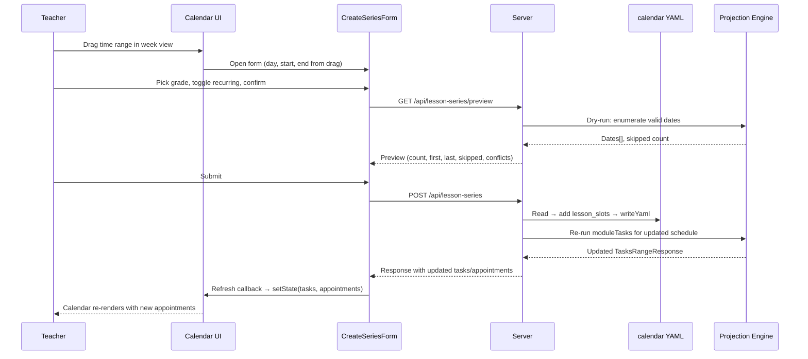

# feat: Interactive Lesson Series Creation via Calendar Drag-Create

## Overview

Extend the companion calendar to let the teacher define their lesson schedule
through drag-create in day/week view. A drag opens a SVAR Editor modal to create
a recurring lesson series for a grade, generating appointments for every valid
school day in a half-year. Series persist as `lesson_slots` in the calendar YAML.
`lesson_days` has been fully removed — `lesson_slots` is the sole scheduling
mechanism. The projection engine uses `weekly_lessons` from `modules.yaml`
independently.

## Problem Frame

The calendar companion lets teachers define their lesson schedule through the UI.
`lesson_slots` in the calendar YAML record which day/time each grade has English.
Lesson schedules typically change at the Halbjahr boundary (Winterferien, Feb 1 in
Sachsen-Anhalt). The projection engine is independent — it uses `weekly_lessons`
from `modules.yaml` to map modules to weeks, not `lesson_slots`.

(see origin: `docs/brainstorms/2026-07-27-001-lesson-series-creation-requirements.md`)

## Requirements Trace

- S1. Drag in day/week view → CreateSeries form (routed by payload)
- S2. Form pre-fills day-of-week + time from drag, teacher can adjust
- S3. Grade picker with DRAFT-grade warning label
- S4. Half-year scope display with auto-detection
- S5. Recurring series skips holidays, weekends, capacity:0 events
- S6. Single appointment when recurring is off
- S7. Preview with loading/error/zero-appointments/conflict states
- S8. Persist to YAML, POST returns updated data, refresh callback
- D1. `lesson_slots` array with id, day, start, end, half_year
- D2. `enumerateSlots` extended for half-year-aware slot consumption
- D3. `half_year_boundary` derived from Winter Holidays in calendar YAML, with
  explicit override field for robustness
- D4. `CalendarFile` YAML gains richer `class_schedule` shape (see origin D4 example)
- P1. `POST /api/lesson-series` endpoint
- P2. Projection engine re-derives appointments from updated `class_schedule` on
  next `GET /api/tasks` (existing behavior, not new work)
- P3. Delete via slot id

## Scope Boundaries

- Series creation, YAML persistence, projection engine integration, calendar
  refresh after creation
- NOT in scope: chat interface (U5 in companion plan), lesson-spec generation
  (Phase 3), bulk series editing UI (v1: delete + recreate), undo/history

## Context & Research

### Relevant Code and Patterns

- `src/schema/types.ts:178-190` — `ClassScheduleEntry`, `CalendarFile` types to extend
- `src/projection/slots.ts` — `enumerateSlots()`, `weightSlots()`, `isHoliday()`, `matchesEvent()` (last two are module-private)
- `src/companion/server/routes/tasks.ts` — handler pattern: `handleXxxRequest(req, res, config)`
- `src/companion/server/moduleTasks.ts` — `moduleTasks()` generates tasks + appointments from placements
- `src/companion/web/Calendar.tsx:328-351` — existing `add-event` intercept with drag-vs-toolbar detection
- `src/schema/yaml.ts:40` — existing `writeYaml(filePath, value)` for YAML persistence
- Route registration: `src/companion/server/index.ts` — `if (method && pathname)` guards
- Test fixtures: `src/companion/server/fixtures/repo/` pattern with vitest

### Institutional Learnings

- `enumerateSlots` is also called by `dateContext` (used by `GET /api/calendar` and `GET /api/lesson-preview`) — changes to its signature affect those callers too
- `moduleTasks.ts` catches DRAFT-module errors with try/catch and silently skips — series for DRAFT grades will persist but produce zero appointments until modules are finalized
- The SVAR calendar's `add-event` intercept provides `action.event.start` as a Date for drag-select but not for the toolbar `+` button — this is the routing discriminator

## Key Technical Decisions

- **KTD1. Projection decoupled from `lesson_slots`.**
  The projection engine uses `weekly_lessons` from `modules.yaml` to compute module
  placement — it does not read `lesson_slots`. `lesson_slots` drive the companion
  calendar's appointment display only. `lesson_days` has been fully removed.
  (see origin D2)

- **KTD2. Half-year boundary = Winterferien `from` date, with explicit override.**
  In Sachsen-Anhalt, the Halbjahr splits at the Winter Holidays (Winterferien, early
  February), not Christmas. Primary: an optional `half_year_boundary` field in the
  calendar YAML (explicit date, e.g. `2027-02-01`). Fallback: the `from` date of the
  first holiday named "Winter Holidays" in the holidays array. The calendar YAML
  validator (U1) asserts that either the explicit field exists OR a holiday named
  "Winter Holidays" is present — fail-fast at validation time, not at runtime.
  H1: first_school_day → day before boundary. H2: day after Winter Holidays `to` →
  last_school_day.
  (see origin D3, H1, H2)

- **KTD3. Series preview computed server-side via dry-run.**
  The preview (S7) needs the same holiday-skipping logic as the real generation. Rather
  than duplicating that logic client-side, a `GET /api/lesson-series/preview` endpoint
  runs the generation without persisting and returns counts. Keeps logic in one place.

- **KTD4. Each `lesson_slot` has a UUID `id` for targeted deletion.**
  Avoids ambiguity when two slots share the same weekday (e.g., two Monday periods).
  (see origin D1)

- **KTD5. All write endpoints require per-session UI token (KTD9 from companion plan).**
  Both `POST /api/lesson-series` and `DELETE /api/lesson-series` require the
  per-session UI token. The Agent SDK chat session does not possess this token, so
  R8's read-only guarantee for chat is unaffected by the new write capability.
  `GET /api/lesson-series/preview` is read-only and subject to the same Origin
  header check as other API routes (KTD9).
  (see origin Key Decisions)

- **KTD6. YAML write uses existing `writeYaml` from `src/schema/yaml.ts`.**
  The calendar YAML has no comments today, so standard serialization is acceptable.
  Key ordering may change; this is a v1 tradeoff accepted for simplicity.

- **KTD7. Process-level mutex around read-modify-write cycle.**
  `persistSeries` and `deleteSeries` read YAML, mutate in memory, and write back.
  Two rapid requests (double-click, two browser tabs) could race and silently drop
  the first write. A simple in-memory async mutex (e.g., `await lock()` /
  `release()` wrapper) serializes all calendar YAML writes. No file-level locking
  needed for a single-process local server.

- **KTD8. Input validation on all write endpoints.**
  `className` must match `/^[A-Za-z0-9_-]+$/`; `day` must be one of
  `[Mon, Tue, Wed, Thu, Fri]`; `start` and `end` must match `HH:MM`; `halfYear`
  must be `1` or `2`; `slotId` must be a valid UUID format. Reject with 400 on
  mismatch. Prevents YAML corruption from malformed input.

## Open Questions

### Resolved During Planning

- **Where does the series preview compute?** Server-side via dry-run endpoint (KTD3).
  Avoids duplicating holiday logic in the browser.
- **How does the calendar refresh after POST?** POST returns the full updated
  `TasksRangeResponse`; the form calls a refresh callback that updates Calendar's
  React state directly.
- **How are two forms routed from one intercept?** `action.event.start instanceof Date`
  → CreateSeries form; otherwise → existing PlanLessonForm.
- **Where does U5 get lesson_slots data?** Embedded in the existing
  `TasksRangeResponse` via a new optional `lessonSlots` field. No new endpoint.
- **How are concurrent writes handled?** In-memory async mutex (KTD7).
- **How is input validated?** Server-side validation contract per KTD8.
- **What about the DELETE token?** Both POST and DELETE require UI token (KTD5).
- **How is the half-year boundary made robust?** Explicit `half_year_boundary` YAML
  field with "Winter Holidays" fallback + calendar validator assertion (KTD2).
- **What about `lesson_days`?** Fully removed. `lesson_slots` is the sole scheduling
  field in `class_schedule`. Projection uses `weekly_lessons` from `modules.yaml`.

### Deferred to Implementation

- Whether `writeYaml` round-trips key order acceptably for git diffs — verify in U3
- Preview endpoint latency — benchmark `generateSeriesDates` in U3 before U4 UI
  work; if > 200ms for a full half-year, consider caching
- ~~Migration path for removing `lesson_days`~~ — Done. `lesson_days` fully removed
  from types, fixtures, tests, and calendar YAML files
- P2 numbering gap: origin doc's P2 ("projection engine re-derives appointments")
  describes existing behavior, not new work — included in Requirements Trace for
  completeness but no implementation unit needed

## High-Level Technical Design

> _This illustrates the intended approach and is directional guidance for review,
> not implementation specification. The implementing agent should treat it as
> context, not code to reproduce._

## Implementation Units

- [ ] **Unit 1: Schema types and half-year boundary**

**Goal:** Extend `ClassScheduleEntry` with `lesson_slots`, add `LessonSlot` type,
and implement half-year boundary derivation from the holidays array.

**Requirements:** D1, D3

**Dependencies:** None (foundational)

**Files:**

- Modify: `src/schema/types.ts`
- Create: `src/projection/halfYear.ts`
- Test: `src/projection/halfYear.test.ts`

**Approach:**

- Add `LessonSlot` interface: `{ id: string; day: string; start: string; end: string; half_year: 1 | 2 }`
- Extend `ClassScheduleEntry` with optional `lesson_slots?: LessonSlot[]`.
  `lesson_days` has been removed entirely.
- Add optional `half_year_boundary?: string` field to `CalendarFile` — explicit
  override for the Halbjahr split date (e.g., `2027-02-01`)
- `halfYear.ts` exports `deriveHalfYearBoundary(calendar: CalendarFile): string` —
  returns `calendar.half_year_boundary` if set, otherwise finds the `from` date of
  the first holiday named "Winter Holidays". Throws if neither exists.
- `halfYear.ts` exports `dateHalfYear(dateIso: string, boundary: string): 1 | 2` —
  returns 1 if date < boundary, 2 otherwise
- `halfYear.ts` exports `halfYearRange(calendar: CalendarFile, halfYear: 1 | 2): { from: string; to: string }` — returns the date range for a half-year
- Add calendar validation rule: assert that either `half_year_boundary` is set OR a
  holiday named "Winter Holidays" exists. This fails fast at `npm run validate` time,
  not at runtime when `enumerateSlots` is called.

**Patterns to follow:**

- Existing type definitions in `src/schema/types.ts`
- Existing date helpers in `src/schema/dates.ts` (e.g., `addDaysIso`)
- Existing calendar validator in `src/schema/calendarValidator.ts`

**Test scenarios:**

- Happy path: `deriveHalfYearBoundary` with explicit `half_year_boundary` field →
  returns that date directly
- Happy path: `deriveHalfYearBoundary` without explicit field, finds "Winter Holidays"
  → returns `2027-02-01`
- Edge: no explicit field AND no "Winter Holidays" entry → throws descriptive error
- Happy path: `dateHalfYear('2026-10-15', '2027-02-01')` → 1
- Happy path: `dateHalfYear('2027-03-15', '2027-02-01')` → 2
- Edge: `dateHalfYear('2027-02-01', '2027-02-01')` (boundary date itself) → 2
- Happy path: `halfYearRange` for H1 returns first_school_day to day before boundary
- Happy path: `halfYearRange` for H2 returns day after Winter Holidays `to` to last_school_day
- Validation: calendar with neither `half_year_boundary` nor "Winter Holidays" → error
- Validation: class_schedule entry with no `lesson_slots` → valid (empty schedule)

**Verification:**

- `npm test` passes; new types compile under `npm run build`

---

- [ ] **Unit 2: Half-year-aware enumerateSlots**

**Goal:** `enumerateSlots` consumes `lesson_slots` with half-year filtering,
supporting multiple slots per weekday and different weekdays per half-year.
`lesson_days` has been removed — no backward compat path needed.

**Requirements:** D2

**Dependencies:** Unit 1

**Files:**

- Modify: `src/projection/slots.ts`
- Modify: `src/projection/slots.test.ts` (existing test file)

**Approach:**

- Use `lesson_slots` exclusively (no `lesson_days` fallback):
  - Derive the half-year boundary via `deriveHalfYearBoundary`
  - For each cursor date, determine its half-year via `dateHalfYear`
  - Collect all `lesson_slots` entries matching that date's weekday AND half-year
  - Produce one `RawSlot` per matching slot (not one per day)
- If `deriveHalfYearBoundary` throws, catch and treat all lesson_slots as active
  (both half-years), logging a warning
- Export `isHoliday` and `matchesEvent` — needed by series generation in U3
- `weightSlots` needs adjustment: when multiple RawSlots exist per calendar day
  (double periods from lesson_slots), `pre_holiday_days` / `post_holiday_days`
  must count by _calendar day_, not by slot index. Group slots by date before
  applying the positional degradation window, so a double-period Monday counts
  as one day toward the N-day pre-holiday window, not two.

**Patterns to follow:**

- Existing `enumerateSlots` structure: walk first_school_day to last_school_day,
  check holiday/event filtering per date

**Test scenarios:**

- Happy path: lesson_slots with Mon H1 + Wed H1 → only Mon/Wed slots in H1 date range
- Happy path: lesson_slots with Mon H1 + Thu H2 → Mon in H1 only, Thu in H2 only
- Happy path: two Monday slots in H1 (double period) → two RawSlots per Monday
- Edge: lesson_slots present but empty → zero slots (no crash)
- Happy path: holidays still skipped when using lesson_slots path
- Happy path: capacity:0 events still skipped when using lesson_slots path
- Integration: `weightSlots` still degrades pre/post-holiday slots from lesson_slots
- Integration: `weightSlots` with double-period Monday before holiday → both Monday
  slots degraded, but only one day consumed from the N-day window (Friday still
  degrades correctly)
- Edge: `deriveHalfYearBoundary` throws (no Winter Holidays) → enumerateSlots
  falls back to all lesson_slots active, logs warning, does not throw
- Edge: no `lesson_slots` field at all → returns empty

**Verification:**

- All `slots.test.ts` tests pass with lesson_slots-based fixtures
- Tests cover per-half-year filtering, multi-slot-per-day, weightSlots
  date-based degradation, and boundary-derivation fallback

---

- [ ] **Unit 3: Series generation logic and server endpoints**

**Goal:** Implement the series date generation, preview endpoint, and creation
endpoint that persists lesson_slots to the calendar YAML.

**Requirements:** S5, S7 (server portion), S8, P1, P3, D4, KTD5, KTD7, KTD8

**Dependencies:** Unit 1, Unit 2

**Files:**

- Create: `src/companion/server/seriesGeneration.ts`
- Create: `src/companion/server/routes/lessonSeries.ts`
- Modify: `src/companion/server/index.ts` (register routes)
- Test: `src/companion/server/seriesGeneration.test.ts`
- Test: `src/companion/server/routes/lessonSeries.test.ts`

**Approach:**

_seriesGeneration.ts:_

- `generateSeriesDates(params: { calendar, day, halfYear, boundary })` → returns
  `string[]` of valid dates: walks the half-year range, keeps dates matching the
  weekday that are not holidays and not blocked by capacity:0 events. Reuses
  `isHoliday` and `matchesEvent` (both exported from slots.ts in U2).
- `seriesPreview(params)` → returns `{ dates: string[], skippedCount: number,
conflicts: Array<{ date, classId, start, end }> }`. Conflicts = existing
  lesson_slots for other classes on the same weekday+time in the same half-year.
- `persistSeries(params: { calendarPath, className, slot: LessonSlot })` → acquires
  the write mutex (KTD7), reads YAML, adds the slot to
  `class_schedule[className].lesson_slots`, writes back via `writeYaml`, releases
  mutex. Creates the `class_schedule[className]` entry if absent.
- `deleteSeries(params: { calendarPath, className, slotId })` → acquires write
  mutex, reads YAML, removes the matching slot by `id`, writes back, releases mutex.
- `validateSeriesInput(params)` → validates all input fields per KTD8:
  className matches `/^[A-Za-z0-9_-]+$/`, day in `[Mon-Fri]`, start/end match
  `HH:MM`, halfYear in `[1, 2]`. Returns 400 error details on mismatch.

_routes/lessonSeries.ts:_

- All three endpoints validate the UI token (KTD5) on POST and DELETE; Origin
  header check on GET preview.
- `GET /api/lesson-series/preview?class=&day=&start=&end=&halfYear=` → validates
  input (KTD8), calls `seriesPreview`, returns preview JSON.
- `POST /api/lesson-series` (JSON body: `{ className, day, start, end, halfYear,
from, to }`) → validates input, generates UUID via `crypto.randomUUID()`, calls
  `persistSeries`, then re-runs `moduleTasks({ from, to })` for the updated
  calendar and returns the full `TasksRangeResponse`. The `from`/`to` params come
  from the client's current calendar view range.
- `DELETE /api/lesson-series?class=&slotId=&from=&to=` → validates UI token and
  input, calls `deleteSeries`, re-runs `moduleTasks({ from, to })`, returns
  updated `TasksRangeResponse`.

_index.ts:_

- Register the three new route handlers following the existing pattern.

**Patterns to follow:**

- Route handler pattern from `routes/tasks.ts`: `sendJson` helper, param validation,
  try/catch
- `writeYaml` from `src/schema/yaml.ts` for persistence
- `moduleTasks()` for re-computing the response after write

**Test scenarios:**

- Happy path: `generateSeriesDates` for Mon H1 in 2026/2027 → correct count of
  Mondays between Aug 15 and Jan 31, minus holidays
- Edge: `generateSeriesDates` for a weekday where every week is a holiday → empty array
- Happy path: `seriesPreview` detects conflict when grade-5 already has Mon 10:00 H1
- Happy path: `persistSeries` adds a lesson_slot to an existing class entry
- Happy path: `persistSeries` creates a new class_schedule entry when none exists
- Edge: `persistSeries` for a className not in plans/ → still writes (schedule-only)
- Happy path: `deleteSeries` removes a slot by id, leaves others intact
- Edge: `deleteSeries` with non-existent slotId → no-op (idempotent)
- Integration: POST /api/lesson-series returns valid TasksRangeResponse with new
  appointments
- Integration: GET /api/lesson-series/preview returns correct counts
- Error: POST with missing required params → 400
- Error: DELETE with missing slotId → 400
- Error: POST with className containing `../` → 400 (KTD8)
- Error: POST with halfYear = 3 → 400 (KTD8)
- Error: POST with day = "Sunday" → 400 (KTD8)
- Error: DELETE without UI token → 401 (KTD5)
- Error: POST without UI token → 401 (KTD5)
- Edge: two rapid POST requests → mutex serializes, both slots persist (KTD7)

**Verification:**

- Unit tests for generation logic; integration tests for HTTP endpoints
- `npm test` and `npm run build` pass

---

- [ ] **Unit 4: CreateSeriesForm component and intercept routing**

**Goal:** Build the frontend form for creating a lesson series, wire it to the
drag-create intercept, and implement the calendar refresh mechanism.

**Requirements:** S1, S2, S3, S4, S5, S6, S7, S8

**Dependencies:** Unit 3

**Files:**

- Create: `src/companion/web/CreateSeriesForm.tsx`
- Modify: `src/companion/web/Calendar.tsx`
- Modify: `src/companion/web/api.ts` (add fetch wrappers)
- Test: `src/companion/web/CreateSeriesForm.test.tsx`

**Approach:**

_CreateSeriesForm.tsx:_

- Props: `{ initialDay, initialStart, initialEnd, initialDate, baseUrl, classes,
onCancel, onCreated(response: TasksRangeResponse), viewRange: { from, to } }`
- State: classId, day, start, end, halfYear, recurring (default: true), preview,
  previewLoading, previewError, submitting
- Auto-detects halfYear from `initialDate` via `dateHalfYear` (imported from U1)
- Field layout (top to bottom): grade picker → day + start/end (inline row) →
  half-year display → recurring toggle → preview region → submit/cancel buttons.
  Recurring toggle is directly above preview so toggling it shows immediate
  cause-and-effect in the preview below.
- Grade picker: custom dropdown (not native `<select>`) to support secondary label
  text. DRAFT grades shown with "(schedule only — no curriculum yet)" subtitle.
  Reuse `plannableClassesFirst` sort from Calendar.tsx.
- Recurring toggle: switch component (not checkbox) — reads as persistent on/off
  state matching the "series vs single" semantic.
- On any field change, fetches `GET /api/lesson-series/preview` (debounced)
- Preview display: total count, first/last date, skipped weeks. Conflict warnings
  show a summary line: "X date(s) conflict with [grade] at this time." Group by
  grade when conflicts span multiple classes; list individual dates only when ≤ 3.
- Loading state: spinner + disabled submit while preview fetches
- Submit in-flight state: `submitting` boolean. While true: disable submit button,
  show spinner in button, prevent field changes. On POST error: inline error
  message above submit, re-enable form.
- Zero appointments: explanatory message + blocked submit
- DRAFT grade post-submit: if POST succeeds but zero appointments appear (DRAFT
  module), show a brief success toast: "Schedule saved. Appointments will appear
  once curriculum modules are finalized."
- Submit sends `POST /api/lesson-series` with `from`/`to` from `viewRange` prop;
  on success, calls `onCreated` with the response
- Accessibility: focus trapped inside dialog while open. On open: focus moves to
  grade picker (first interactive field). Escape key calls `onCancel`. Cancel
  button in footer. `aria-live="polite"` on preview region for screen reader
  updates.

_Calendar.tsx changes:_

- Intercept routing: check `'event' in action && action.event.start instanceof Date`
  (existing pattern from line 343). This distinguishes drag-select (has Date start)
  from toolbar+ (no event or no start). If SVAR ever normalizes both to Date,
  add a secondary check on `action.event.end` (drags have end, toolbar does not).
  Pin SVAR version to prevent silent breakage.
- New state: `createSeriesProps: { day, start, end, date } | null`
- `onCreated` callback: updates `tasks`, `appointments`, `classes`, and
  `lessonSlots` state from the response, then closes the form
- Pass `viewRange` (current `from`/`to` from the calendar fetch params) to the
  form so POST/DELETE can include it for the TasksRangeResponse computation
- Note in S1: series creation only available in day/week view; toolbar `+` works
  from any view for single-date planning

_api.ts additions:_

- `fetchSeriesPreview(params)` wrapping `GET /api/lesson-series/preview`
- `createLessonSeries(params)` wrapping `POST /api/lesson-series`
- `deleteLessonSeries(params)` wrapping `DELETE /api/lesson-series`

**Patterns to follow:**

- Existing `PlanLessonForm` in Calendar.tsx: same dialog pattern, useEffect for
  preview fetching, canSubmit gating
- Existing `fetchLessonPreview` / `fetchModuleTasks` in api.ts

**Test scenarios:**

- Happy path: form renders with pre-filled day/start/end from drag props
- Happy path: changing grade triggers new preview fetch
- Happy path: recurring toggle off → preview shows single date
- Happy path: submit calls POST and invokes onCreated callback
- Edge: DRAFT grade shows "(schedule only)" label
- Edge: zero valid appointments → submit disabled, message shown
- Edge: conflict detected → warning displayed (non-blocking)
- Edge: preview loading → submit disabled, spinner shown
- Error: preview fetch fails → error message displayed
- Error: POST fails → inline error, form re-enabled, submit not double-fired
- Edge: POST for DRAFT grade succeeds with zero appointments → success toast
  explains "appointments appear once modules are finalized"
- Edge: conflict warning with > 3 dates → summary count shown, not date list
- Accessibility: Escape key closes form
- Accessibility: focus moves to grade picker on open
- Integration: Calendar intercept routes drag-select to CreateSeriesForm
- Integration: Calendar intercept routes toolbar+ to PlanLessonForm
- Integration: onCreated updates Calendar state (tasks, appointments refresh)

**Verification:**

- Component tests with mocked API responses
- Manual verification in running dev server: drag in week view → form opens,
  create series → appointments appear

---

- [ ] **Unit 5: Delete series UI and wiring**

**Goal:** Add a way to delete an existing lesson series from the calendar UI,
completing the create/delete lifecycle (v1 editing = delete + recreate).

**Requirements:** P3

**Dependencies:** Unit 3, Unit 4

**Files:**

- Modify: `src/companion/web/Calendar.tsx`
- Test: `src/companion/web/Calendar.test.tsx` (extend existing)

**Approach:**

- Extend `TasksRangeResponse` (returned by `moduleTasks`) with an optional
  `lessonSlots: Record<string, LessonSlot[]>` field keyed by className. Populated
  from the calendar YAML's `class_schedule` in `moduleTasks()`. This avoids a new
  endpoint — the data piggybacks on the existing `/api/tasks` response that the
  calendar already fetches.
- When clicking a task (spanning module bar), the existing task-detail panel gains
  a "Manage schedule" section listing the lesson_slots for that class+half-year
  (read from the `lessonSlots` field in Calendar's state)
- Each slot shows day + time + half-year with a "Remove" button
- Remove in-flight state: disable the Remove button on click, show per-row loading
  indicator. On failure: re-enable button, show inline error beside the slot row.
- Remove calls `DELETE /api/lesson-series?class=&slotId=&from=&to=` with the
  current view range; on success, refreshes calendar state via the same
  `onCreated`-style callback from U4

**Patterns to follow:**

- Existing task-detail panel in Calendar.tsx (lines 372-385)
- Same refresh mechanism from U4

**Test scenarios:**

- Happy path: task-detail shows lesson_slots for the selected class
- Happy path: clicking Remove calls DELETE and refreshes calendar
- Edge: class with no lesson_slots → "No schedule defined" message
- Edge: removing the last slot for a class → class still appears in panel but with
  no appointments
- Error: DELETE fails → Remove button re-enabled, inline error shown
- Edge: rapid double-click on Remove → button disabled on first click prevents
  double-fire

**Verification:**

- Component test for delete interaction
- Manual verification: create a series, then delete it → appointments disappear

## System-Wide Impact

- **Interaction graph:** `enumerateSlots` is called by both `moduleTasks` (calendar
  display) and `dateContext` (lesson preview / chat seeding). Changes to its
  signature or behavior affect both paths — test both after U2.
- **State lifecycle risks:** `writeYaml` writes synchronously; if the server crashes
  mid-write, the YAML could be truncated. Acceptable for a single-teacher local
  tool; a temp-file-then-rename approach is a possible hardening in the future.
- **API surface change:** `TasksRangeResponse` gains an optional `lessonSlots`
  field (`Record<string, LessonSlot[]>`) so the calendar UI can display and manage
  the teacher's schedule without a separate endpoint. Existing consumers that
  destructure only `{ classes, tasks, appointments }` are unaffected.
- **Write mutex:** All calendar YAML writes are serialized through an in-memory
  async mutex (KTD7), preventing read-modify-write races from concurrent requests.
- **Unchanged invariants:** `GET /api/calendar`, `GET /api/lesson-preview`, and
  `POST /api/chat` are unaffected. The chat session's read-only guarantee (R8) is
  preserved — both `POST` and `DELETE /api/lesson-series` require the UI token the
  agent doesn't have (KTD5).

## Risks & Dependencies

| Risk                                                                      | Mitigation                                                                                                                                                                                                                                |
| ------------------------------------------------------------------------- | ----------------------------------------------------------------------------------------------------------------------------------------------------------------------------------------------------------------------------------------- |
| `writeYaml` reorders YAML keys, making git diffs noisy                    | Calendar YAML has no comments; key reorder is cosmetic. Verify in U3 and accept for v1                                                                                                                                                    |
| Drag-select payload shape changes in a SVAR update                        | Pin `@svar-ui/react-calendar` version; the intercept check is already proven in the current build                                                                                                                                         |
| `enumerateSlots` signature change breaks `dateContext` callers            | U2 tests cover backward compat; `dateContext` tests already exist                                                                                                                                                                         |
| DRAFT grades (5/6) accept series but show no appointments                 | Warning label in grade picker (S3); post-submit toast explains timing; appointments appear once modules are finalized                                                                                                                     |
| `calendarValidator` rejects class_schedule keys without matching `plans/` | Only applies when teacher creates schedule for a className that doesn't exist in plans/ — unlikely in normal flow. If hit, the validator warns but the schedule still functions. Can relax the validator to warning-level in U1 if needed |
| `lesson_slots` shape malformed in hand-edited YAML                        | Calendar validator (U1) checks structure at `npm run validate` time; `enumerateSlots` guards against malformed entries at runtime                                                                                                         |

## Verification Contract

| Command                   | Units | What it proves                                     |
| ------------------------- | ----- | -------------------------------------------------- |
| `npm test`                | U1-U5 | All new and existing tests pass                    |
| `npm run build`           | All   | TypeScript compiles with new types                 |
| `npm run validate`        | All   | Existing curriculum/calendar validation unaffected |
| Manual: drag in week view | U3-U4 | Series creation end-to-end                         |
| Manual: delete a series   | U5    | Delete + calendar refresh                          |

## Sources & References

- **Origin document:** [docs/brainstorms/2026-07-27-001-lesson-series-creation-requirements.md](docs/brainstorms/2026-07-27-001-lesson-series-creation-requirements.md)
- **Parent plan:** [docs/plans/2026-07-25-002-feat-local-teacher-companion-plan.md](docs/plans/2026-07-25-002-feat-local-teacher-companion-plan.md) (U4 calendar view)
- Related code: `src/projection/slots.ts`, `src/companion/web/Calendar.tsx`, `src/companion/server/moduleTasks.ts`
- Calendar data: `calendar/sachsen-anhalt-2026-2027.yaml`
