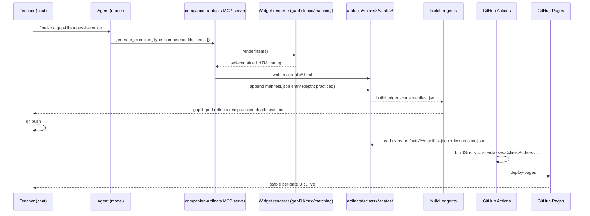

# feat: Generation pipeline + artifact delivery (Phase 3)

## Goal Capsule

- **Objective:** replace the chat's free-form `save_material` writes with typed,
  self-contained exercise widgets (`gap_fill`, `mcq`, `matching`) whose generation
  produces a real `covered` record for the coverage ledger, and close the delivery
  gap so generated lesson specs/materials are reachable by URL — both locally
  (companion UI) and after `git push` (GitHub Pages) — with the calendar linking
  back to them.
- **Authority:** implementation-ready; the implementer may adjust widget markup,
  manifest field names, and site-generator internals as implementation reveals
  better shapes, but the MCP-tool-only write posture (KTD1) and the artifacts-as-
  source/site-as-build-output split (KTD5) are load-bearing and not open to revision
  without a new planning pass.
- **Execution profile:** software, TypeScript, no live-SDK cost in the default test
  suite (all new server-side logic is deterministic and unit-testable without the
  Agent SDK).
- **Stop conditions:** `npm test`, `npm run build`, `npm run validate` all pass;
  `npm run build:site` produces a `site/` tree following the §4.7 URL scheme from a
  fixture `artifacts/` tree; a manual push-and-view smoke test confirms Pages
  serves it.

## Problem Frame

Per `docs/spec/03-generation.md` §4.2-4.3 and the roadmap's own
"Implementation status" note (`docs/spec/04-roadmap.md` §5.1), two things are
missing:

1. **Component G/H (generation pipeline).** The chat currently calls the
   free-form `save_material` tool (`src/companion/server/artifactTools.ts`) with
   raw `html`/`md` content the model writes directly — there is no typed exercise
   request, no per-type widget renderer wired into the save path (only
   `src/widgets/gapFill.ts` exists, unwired, a Phase-1 spike), and no `covered`
   record distinct from the lesson-spec plan itself. `buildLedger.ts` currently
   folds every `lesson-spec.json` in at a blanket `'introduced'` depth because
   that's all it has to go on.
2. **Component I (artifact registry / static delivery).** `.github/workflows/`
   does not exist — nothing deploys to GitHub Pages despite the README and
   roadmap both asserting `git push` → Pages. The `artifacts/<class>/<date>/`
   working layout doesn't match the §4.7 URL scheme
   (`/classes/<class>/<date>/`), there's no site index, and no `lesson-plan.html`
   human-facing render of a `lesson-spec.json`. Separately, the companion
   calendar's appointment popup shows only a "· planned" text label
   (`src/companion/web/Calendar.tsx`'s `EventContent`) — it never links to the
   actual generated materials, even though `Appointment.hasLessonSpec` already
   carries the boolean needed to know a lesson-spec exists.

These were originally two spec components (G/H and I) with no phase number
assigned to I at all. They're planned together here because the manifest this
plan introduces (unit of "what got generated, for which competences, at what
depth") is the one artifact both the coverage ledger *and* the site generator
need to agree on.

## Requirements

- **R1.** A new typed MCP tool accepts a structured exercise request
  (`{ type: 'gap_fill'|'mcq'|'matching', competenceIds, title, items }`),
  dispatches to the matching widget renderer, and writes the resulting
  self-contained HTML under `artifacts/<class>/<date>/materials/`.
- **R2.** `mcq` and `matching` widget renderers exist alongside `gap_fill`,
  following its self-contained-HTML-with-inline-self-check pattern.
- **R3.** Every typed-tool save appends an entry to
  `artifacts/<class>/<date>/manifest.json` recording `{ file, type, title,
  competenceIds, depth, createdAt }` — this is the `covered` record (§3.7a).
- **R4.** `buildLedger.ts` prefers `manifest.json` entries (real depth) over the
  current lesson-spec-only `'introduced'` cap when a date has one, falling back
  to today's behavior when it doesn't (no regression for dates with only a
  lesson-spec).
- **R5.** A deterministic static-site generator (`src/publish/buildSite.ts`)
  reads every `artifacts/<class>/<date>/` folder and produces a `site/` tree
  matching the §4.7 URL scheme: a root index, one page per class, one page per
  lesson date rendering the lesson-spec as a readable `lesson-plan.html` with
  links to each material.
- **R6.** A GitHub Actions workflow builds the site and deploys it to GitHub
  Pages on push to the default branch.
- **R7.** The companion server exposes a read-only route to serve files under
  `artifacts/` so the calendar UI can link to materials during authoring, without
  waiting for a push.
- **R8.** The calendar's appointment popup and/or task-detail panel link to the
  existing lesson-spec and each generated material for that date, instead of the
  current static "· planned" text.

## Scope Boundaries

- In scope: `gap_fill`, `mcq`, `matching` widget renderers and their typed save
  path; `manifest.json` + ledger integration; the static site generator; the
  Pages deploy workflow; calendar links to existing artifacts.
- Out of scope (per the roadmap's first-build set ordering): `error_correction`
  and `crossword` widgets — follow in a later plan. The full lesson-plan
  *structuring* step (§4.2 step 1 — objectives/timed stages/differentiation
  notes as a distinct generated artifact) is also deferred; this plan wires the
  exercise-widget half of generation, not the lesson-plan-body half.
- Not in scope: the `klassenarbeit` skill (§5.6) and its AFB/Notenschlüssel
  tagging — a separate, legally-grounded skill with its own plan.

### Deferred to Follow-Up Work

- `error_correction`, `crossword`, and the remaining exercise-type skills from
  §4.3's full catalog.
- Depth escalation to `'assessed'` for exercises generated in a test/Klassenarbeit
  context — that context doesn't exist yet (depends on the `klassenarbeit`
  skill), so this plan's depth-assignment rule (KTD3) only ever produces
  `'practiced'`.
- A richer site-generator theme/design system; this plan's HTML output is
  minimal and functional, not styled to a brand.

## Key Technical Decisions

- **KTD1. Typed exercise requests go through a new MCP tool, not raw
  `save_material`.** Keeps the same validated-schema posture `save_lesson_spec`/
  `save_material` already established (KTD2/KTD10 from the companion plan) —
  the model supplies structured data, the server renders it deterministically.
  `save_material`'s schema drops its `'exercise'` enum value (narrowed to
  `homework`/`test`/`notes`) so it's no longer a live, untracked bypass around
  `generate_exercise` — without this, the model could save exercise-shaped
  content through the old free-form tool and it would never reach
  `manifest.json` or the ledger. `COMPANION_INSTRUCTIONS` (`agentSession.ts`)
  is updated accordingly: exercises go through `generate_exercise`,
  `save_material` stays for homework/notes/tests only.
- **KTD2. `manifest.json` is the ledger's preferred coverage source — this
  records authoring, not confirmed classroom delivery.**
  `buildLedger.ts`'s `lessonSpecToCoverage` today caps every competence at
  `'introduced'` because a lesson-spec is a pre-lesson plan, not confirmed
  delivery. A `manifest.json` entry — a widget was actually generated and saved
  — is stronger evidence than a plan, so it wins per-competence when both exist
  for a date; competences named in the lesson-spec but absent from the manifest
  keep the existing `'introduced'` fallback. Named limitation: a manifest entry
  proves a worksheet was authored, not that it was assigned to or completed by a
  pupil — the same EXPOSURE-not-mastery caveat the roadmap already applies to
  lesson-spec-derived coverage (`docs/spec/04-roadmap.md` §5.8) extends to
  manifest-derived coverage too; `gapReport` consumers should read `'practiced'`
  as "material exists," not "students practiced it."
- **KTD3. Depth-assignment rule: exercise type → `'practiced'`, always, for
  now.** The roadmap's own risk note (§5.7 "Real risks it surfaced") calls for a
  deterministic rule, not vibes. Since `error_correction`/production-tagged
  exercises and the test-context escalation to `'assessed'` are both out of
  scope here, the rule collapses to one case: any `gap_fill`/`mcq`/`matching`
  widget save records `'practiced'` for each of its `competenceIds`. Revisit
  when production-type widgets or the `klassenarbeit` skill land.
- **KTD4. `matching` uses SortableJS (MIT); `gap_fill`/`mcq` stay vanilla TS.**
  Matches the exercise-design-reference's own decision (`docs/spec/
06-exercise-design-reference.md` "First-build set") — SortableJS is the one
  verified-MIT dependency addition for drag-drop; everything else is hand-built,
  consistent with `gapFill.ts`'s existing style (inline `<script>`, no imports at
  render time — the render function emits plain JS as a string).
- **KTD5. Static site generation is separate, deterministic code
  (`src/publish/buildSite.ts`), not served by the companion's Express process.**
  Mirrors the spec's own two-layer split (§4.7): the companion (`src/companion/`)
  is the local authoring environment; `site/` is pure build output regenerated by
  CI on every push. `site/` is gitignored — never hand-committed, never diffed;
  CI is the only writer.
- **KTD6. The companion's artifact-preview route is a local convenience, not the
  publish path.** `GET /api/artifacts/<class>/<date>/<file>` (or similar) serves
  files straight from the repo's `artifacts/` directory for in-app links before a
  push — still `127.0.0.1`-only, still behind the existing Origin check. Publish
  remains `git push` → Actions → Pages; this route never touches `site/`.
- **KTD7. `manifest.json` lives beside `lesson-spec.json`, one per class+date,
  not one global file.** Consistent with the existing per-date `artifacts/<class>/
<date>/` granularity everywhere else in the repo (lesson-spec, materials).

## High-Level Technical Design

## Implementation Units

### U1. `mcq` and `matching` widget renderers

**Goal:** Add `src/widgets/mcq.ts` and `src/widgets/matching.ts` following
`src/widgets/gapFill.ts`'s pattern — typed item interfaces, a pure checker
function, and a `render*Html` function producing one self-contained HTML file.

**Requirements:** R2

**Dependencies:** None

**Files:**

- Create: `src/widgets/mcq.ts`
- Create: `src/widgets/mcq.test.ts`
- Create: `src/widgets/matching.ts`
- Create: `src/widgets/matching.test.ts`
- Modify: `package.json` (add `sortablejs` + `@types/sortablejs`, MIT-verified per
  `docs/spec/06-exercise-design-reference.md`)

**Approach:**

- `mcq.ts`: `McqItem { question: string; options: string[]; correctIndex: number }`,
  `checkAnswer(selectedIndex, item): CheckResult` (reuse `gapFill.ts`'s
  `'correct'|'incorrect'|'unanswered'` union), `renderMcqHtml(title, items:
McqItem[])` — radio-button options per question (native `<input type="radio">`
  with an associated `<label>`, keyboard-operable by default), checked via an
  explicit "Check" button per question (not auto-check on select, so a student
  can change their answer before committing) mirroring `gapFill.ts`'s existing
  check-button pattern. Selected/correct/incorrect/unanswered states are each a
  distinct CSS class (extending `gapFill.ts`'s existing `.correct`/`.incorrect`
  convention), inline JS self-check mirroring the checker.
- `matching.ts`: `MatchingPair { left: string; right: string }`,
  `renderMatchingHtml(title, pairs: MatchingPair[])` — two shuffled columns,
  SortableJS-powered drag between them (or click-to-select-then-click-to-pair as
  the accessible fallback for keyboard users — SortableJS is pointer-only),
  inline self-check comparing final pairing against the answer key. Distinct CSS
  classes for available/selected/correctly-paired/incorrectly-paired states,
  same convention as `mcq.ts`. Bundle SortableJS inline (its UMD build is small
  and MIT) rather than a `<script src>` CDN reference, preserving the "no
  external dependency at file-open time" rule (§4.4).
- Both widgets inherit `docs/spec/03-generation.md` §4.4's existing shared
  conventions — keyboard-usable, sufficient contrast, degrades to a printable
  static page without JS — the same requirements `gap_fill` already meets; this
  unit's job is to carry them into two more widget types, not invent new ones.
- Both files export their item types + render function only — no MCP/tool
  wiring here (that's U2).

**Patterns to follow:** `src/widgets/gapFill.ts` end-to-end (escape-HTML helper,
inline `<style>`, inline `<script>` duplicate-logic-as-plain-JS approach, browser
self-check via `document.getElementById`).

**Test scenarios:**

- Happy path: `checkAnswer` returns `'correct'` for the correct index, `'incorrect'`
  for a wrong one, `'unanswered'` for `null`/absent.
- Happy path: `renderMcqHtml` output contains one radio group per question, escapes
  HTML in question/option text (e.g. an option containing `<script>` renders inert).
- Edge: `renderMcqHtml` with a single item, and with an empty `options` array
  (must not throw — render an empty/degenerate control rather than crash).
- Happy path: `renderMatchingHtml` output pairs shuffle deterministically off a
  provided seed (or accepts a pre-shuffled order) so tests aren't flaky.
- Happy path: matching self-check correctly marks a fully-correct pairing and a
  fully-incorrect one.
- Edge: `renderMatchingHtml` with duplicate `left`/`right` text — pairing logic
  keys off index/position, not text equality, so duplicates never collide.

**Verification:** `npm test` covers all four functions' happy/edge paths; the
rendered HTML strings from a snapshot fixture visually check clean in a browser
(manual, once — not automated).

---

### U2. Typed `generate_exercise` MCP tool

**Goal:** Add a new tool to `createLessonArtifactServer`
(`src/companion/server/artifactTools.ts`) that accepts a typed exercise request,
dispatches to the matching U1 renderer, writes the HTML under `materials/`, and
appends a `manifest.json` entry. Update the chat's system prompt and narrow
`save_material`'s schema so the new tool is actually reachable and isn't
bypassable (KTD1) — registering a tool on the MCP server doesn't by itself
change what the model is instructed to call.

**Requirements:** R1, R3, KTD1, KTD3, KTD7

**Dependencies:** U1

**Files:**

- Modify: `src/companion/server/artifactTools.ts`
- Modify: `src/companion/server/artifactTools.test.ts`
- Modify: `src/companion/server/agentSession.ts` (`COMPANION_INSTRUCTIONS`)

**Approach:**

- New Zod schema: `GenerateExerciseSchema = { type: z.enum(['gap_fill', 'mcq',
'matching']), title: z.string(), competenceIds: z.array(z.string()), items:
z.array(z.unknown()) }` — the exact per-type `items` shape is validated a second
  level down by a per-type Zod union (or a discriminated union on `type`) so a
  `gap_fill` request can't smuggle `mcq`-shaped items.
- New tool `generate_exercise`: validates `type`, dispatches to
  `renderGapFillHtml`/`renderMcqHtml`/`renderMatchingHtml` per KTD1, writes the
  result via the existing `atomicWriteFileSync` under `materials/<type>-<slug>.html`
  (reuse `slugify`), then reads-appends-writes `manifest.json` (atomic write-then-
  rename per the existing convention in this file) with a new entry `{ file, type,
  title, competenceIds, depth: 'practiced' (KTD3), createdAt: new Date().toISOString()
}`.
- `manifest.json` starts as `{ class, date, materials: [] }` when absent (KTD7 —
  one per class+date, created lazily on first save).
- Class/date validation mirrors `save_lesson_spec`'s existing rejection pattern —
  not needed here since this tool takes no `class`/`date` params (they're already
  fixed by the session's `classId`/`date` closure), so there's nothing to mismatch.
- `MaterialSchema`'s `type` enum drops `'exercise'` (narrowed to
  `z.enum(['homework', 'test', 'notes'])`) so `save_material` can no longer save
  exercise-shaped content outside the tracked `generate_exercise` path (KTD1).
- `COMPANION_INSTRUCTIONS` is rewritten: the existing `save_material` section's
  "exercises, homework, tests, or notes" line is split so exercises route to a
  new `generate_exercise` description (parameters: `type`, `title`,
  `competenceIds`, `items`), and `save_material` is described as
  homework/test/notes only.

**Patterns to follow:** The existing `save_lesson_spec`/`save_material` tool
definitions in the same file — same `tool()` call shape, same
`atomicWriteFileSync` helper, same rejection-response shape (`isError: true` +
explanatory text) for validation failures.

**Test scenarios:**

- Happy path: `generate_exercise({ type: 'gap_fill', ... })` writes a file under
  `materials/` and creates `manifest.json` with one entry, `depth: 'practiced'`.
- Happy path: a second call for a different `type` appends to the existing
  `manifest.json` rather than overwriting it.
- Happy path: `mcq`/`matching` requests dispatch to their respective renderers
  (verify via distinguishing output content, e.g. presence of a radio input vs. a
  drag-pair structure).
- Error: `type: 'mcq'` with `items` shaped like `gap_fill` items → rejected with
  `isError: true`, no file written, `manifest.json` unchanged.
- Error: empty `title` → rejected (mirrors `save_material`'s empty-slug rejection).
- Edge: two rapid calls for the same date (simulating overlapping tool calls in
  one turn) → both entries land in `manifest.json`, neither overwrites the other
  (verify the atomic read-modify-write doesn't race — a simple sequential await in
  the test is enough given the SDK serializes tool calls within one turn; note
  if this assumption needs revisiting for parallel tool-call SDK behavior).
- Error: `save_material({ type: 'exercise', ... })` is rejected by
  `MaterialSchema` (Zod validation failure) — confirms the bypass is closed.

**Verification:** `npm test` passes; a manual chat turn (or the existing
mocked-SDK pattern from `agentSession.test.ts`) confirms the tool is reachable
from a session and `COMPANION_INSTRUCTIONS` mentions `generate_exercise`.

---

### U3. Ledger reads `manifest.json` for real coverage depth

**Goal:** `buildLedger.ts` prefers `manifest.json` entries over the
lesson-spec-only `'introduced'` cap.

**Requirements:** R4, KTD2

**Dependencies:** U2

**Files:**

- Modify: `src/companion/server/buildLedger.ts`
- Modify: `src/companion/server/buildLedger.test.ts`

**Approach:**

- Add a sibling scan alongside `walkLessonSpecFiles`: `walkManifestFiles(dir)`
  finds every `manifest.json` under a class's `artifacts/` tree.
- New `manifestToCoverage(manifest, date): LessonCoverage` maps each manifest
  entry to a `CoveredRecord { competence, depth: entry.depth, via: [entry.type] }`
  — one `CoveredRecord` per `competenceId` per manifest entry (an entry with
  multiple `competenceIds` fans out to multiple records, matching
  `CoveredRecord`'s one-competence-per-record shape already used by
  `lessonSpecToCoverage`).
- `buildLedger` now folds in *both* lesson-spec-derived and manifest-derived
  `LessonCoverage` per date; `coverageLedger`'s existing max-depth-wins folding
  logic (`src/coverage/ledger.ts`) already handles picking the stronger depth per
  competence when both a lesson-spec (`'introduced'`) and a manifest entry
  (`'practiced'`) exist for the same date+competence — no change needed there,
  confirm with a test rather than modifying `ledger.ts`.

**Patterns to follow:** `lessonSpecToCoverage`'s existing shape and the
`walkLessonSpecFiles` recursive-directory-walk helper (reuse or generalize it to
also match `manifest.json`, whichever is less duplicative once written).

**Test scenarios:**

- Happy path: a date with only a `lesson-spec.json` (no manifest) → ledger shows
  `'introduced'` (unchanged existing behavior — regression guard).
- Happy path: a date with both a `lesson-spec.json` and a `manifest.json` whose
  entry covers the same competence at `'practiced'` → ledger shows `'practiced'`
  (the stronger depth wins).
- Happy path: a manifest entry naming a competence *not* in that date's
  lesson-spec → still folds into the ledger for that competence.
- Edge: a class directory with a `manifest.json` present but empty `materials:
[]` → no coverage contribution, no crash.
- Edge: `manifest.json` with a competence covered by two different entries at
  different depths on different dates → ledger's existing max-depth-across-dates
  logic still applies (verify, don't reimplement).
- Edge: a `produce`-required competence covered only by an `mcq` or `matching`
  manifest entry (`'practiced'` depth) → `meetsRequiredDepth`
  (`src/coverage/ledger.ts`) still reports it as under-depth, because
  `PRODUCTIVE_EXERCISE_TYPES` doesn't include `mcq`/`matching` (only `gap_fill`
  and other production-style types). This is expected, not a bug this unit
  fixes — the test documents the boundary so System-Wide Impact's claim stays
  accurate.

**Verification:** `npm test` passes; `gapReport`/`coverageLedger` tests
(existing, unmodified) still pass, confirming this unit didn't change their
public contract.

---

### U4. Companion serves `artifacts/` read-only; calendar links to materials

**Goal:** A new server route exposes generated files for in-app preview; the
calendar's appointment popup and task-detail panel link to them instead of a
static "· planned" label.

**Requirements:** R7, R8, KTD6

**Dependencies:** U2 (needs real materials to link to; U1/U3 not required),
U5 (reuses `renderLessonPage` for the local lesson-spec preview)

**Files:**

- Create: `src/companion/server/routes/artifacts.ts`
- Create: `src/companion/server/routes/artifacts.test.ts`
- Modify: `src/companion/server/index.ts` (register the route)
- Modify: `src/companion/server/moduleTasks.ts` (extend `Appointment` with
  material info)
- Modify: `src/companion/web/Calendar.tsx` (render links)
- Modify: `src/companion/web/api.ts` (typed fetch, if a new endpoint call is
  needed — likely not, since materials info piggybacks on the existing
  `/api/tasks` response per the existing `lessonSlots` pattern)

**Approach:**

- `GET /api/artifacts/<class>/<date>/<...path>`: validates the Origin header
  (existing `security.ts` helper) and, before constructing any filesystem path,
  validates `class` against the known class list (same exact-match pattern as
  `dateContext.ts`'s `loadClassData`) and `date` against a strict `YYYY-MM-DD`
  regex — rejecting unknown/malformed values with 400. Only after that
  whitelist check does it resolve `<...path>` and confirm (via `path.resolve`/
  `path.relative` against the fixed `repoRoot/artifacts` root, not the
  already-validated `<class>/<date>` subpath) that the result stays inside it.
  This ordering matters: `class`/`date` are themselves attacker-supplied URL
  segments, so anchoring the traversal check on `artifacts/<class>/<date>/`
  before validating those segments would let a value like `class=..` relocate
  the "base" the check resolves against. Serves the file with a content-type
  sniffed from extension (`.html` → `text/html`, `.json` → `application/json`).
  Read-only, no token required (matches `GET /api/calendar`'s existing
  unauthenticated-read posture) — KTD6.
- For the `lesson-spec.json` preview specifically, the route renders it through
  `renderLessonPage` (U5) into HTML rather than serving the raw JSON — keeps the
  local-authoring preview consistent with what the published site shows,
  instead of handing a non-technical teacher a raw JSON file.
- Extend `Appointment` (`moduleTasks.ts`) with `materials: Array<{ file: string;
type: string; title: string }>` populated from that date's `manifest.json` when
  present (empty array otherwise) — same "piggyback on the existing response"
  pattern the lesson-series plan used for `lessonSlots`.
- `Calendar.tsx`'s `EventContent` appointment branch: replace the static
  "· planned" text with a link (or small list of links, one per material) to
  `GET /api/artifacts/.../materials/<file>` opened in a new tab with
  `rel="noopener noreferrer"` (the material is self-contained HTML with inline
  `<script>`; without `noopener` a new tab retains a `window.opener` handle back
  to the authenticated companion tab), plus a link to the rendered lesson-spec
  preview when `hasLessonSpec` is true.

**Patterns to follow:** The existing `lessonSlots` piggyback pattern (added to
`TasksRangeResponse` in the lesson-series-creation work) for how to extend an
existing response without a new endpoint; `security.ts`'s `originMatches` helper
for the new route's Origin check; `dateContext.ts`'s `loadClassData` for the
known-class-list validation.

**Test scenarios:**

- Happy path: `GET /api/artifacts/<class>/<date>/materials/<file>.html` returns
  the file with `content-type: text/html`.
- Error: an unknown `class` value (not in `plans/*/class.yaml`) → rejected with
  400 before any filesystem access.
- Error: a malformed `date` value (not `YYYY-MM-DD`) → rejected with 400 before
  any filesystem access.
- Error: `class=..` or `date=..` (attempting to relocate the base directory
  itself) → rejected by the class/date whitelist check, not merely by the
  downstream traversal check.
- Error: a path segment containing `../` → rejected (400 or 404, not a
  traversal read).
- Error: request with a mismatched/missing Origin header → rejected, matching
  existing route conventions.
- Happy path: `moduleTasks()`'s `Appointment.materials` reflects a fixture
  `manifest.json`'s entries; empty array when no manifest exists for that date.
- Happy path: `Calendar.tsx` renders a clickable link per material (with
  `rel="noopener noreferrer"`) and one for the rendered lesson-spec preview when
  present (component test, extending the existing `Calendar.test.tsx` fixture
  data).
- Edge: appointment with `hasLessonSpec: true` but zero materials → still shows
  the lesson-spec link, no broken/empty materials list.

**Verification:** `npm test` passes; manual check in the running dev server —
click an appointment with saved materials, confirm the links open the actual
generated HTML.

---

### U5. Static site generator (`src/publish/buildSite.ts`)

**Goal:** Deterministic code that reads every `artifacts/<class>/<date>/` folder
and produces a `site/` tree matching the §4.7 URL scheme, ready for GitHub Pages.

**Requirements:** R5, KTD5, KTD7

**Dependencies:** None (reads whatever `artifacts/` contains at build time;
independent of U1-U4 landing first, though it has nothing to render until they
do)

**Files:**

- Create: `src/publish/buildSite.ts`
- Create: `src/publish/buildSite.test.ts`
- Create: `src/publish/renderLessonPage.ts` (the `lesson-spec.json` →
  human-readable `lesson-plan.html` renderer)
- Create: `src/publish/renderLessonPage.test.ts`
- Modify: `package.json` (add `build:site` script)
- Modify: `.gitignore` (add `site/`)

**Approach:**

- `buildSite(params: { repoRoot, outDir })`: walks `plans/*/class.yaml` for the
  known class list (mirrors `dateContext.ts`'s `loadClassData` pattern), then
  walks `artifacts/<class>/**` for every date directory containing a
  `lesson-spec.json`.
- For each class+date: render `outDir/classes/<class>/<date>/index.html` via
  `renderLessonPage` (lesson-spec fields → objectives/context summary + a link
  list of each material file, reusing `manifest.json`'s `title`/`type` for link
  text when present, falling back to the raw filename otherwise), and copy every
  `materials/*.html` file alongside it.
- Generate `outDir/classes/<class>/index.html`: a simple list of that
  class's dates linking to each lesson page.
- Generate `outDir/index.html`: a list of classes linking to each class page.
- `renderLessonPage.ts` is pure (`LessonSpec` + optional `Manifest` in, HTML
  string out) — no filesystem access — so it's unit-testable without touching
  disk; `buildSite.ts` owns all `readFileSync`/`writeFileSync`/directory-walk
  concerns and calls it.

**Patterns to follow:** `dateContext.ts`'s `loadClassData` for the
`plans/*/class.yaml` walk convention; `buildLedger.ts`'s recursive directory-walk
helper for finding `lesson-spec.json`/`manifest.json` files; `gapFill.ts`'s
`escapeHtml` helper (or a shared extraction if duplicated across three files
becomes unwieldy — implementer's call, not a hard requirement of this plan).

**Test scenarios:**

- Happy path: a fixture `artifacts/` tree with two classes, one date each →
  `buildSite` produces `index.html`, two class pages, two lesson pages, with
  materials copied alongside each lesson page.
- Happy path: `renderLessonPage` output includes the module title, focus
  competences, and a link per manifest entry with its `title` as link text.
- Edge: a lesson-spec with no corresponding `manifest.json` yet (materials not
  generated) → lesson page renders with a "no materials yet" note, not a crash or
  broken links.
- Edge: `artifacts/` directory absent entirely (fresh clone, day one) →
  `buildSite` produces a valid empty-but-non-crashing `site/` (root index with
  zero classes listed) rather than throwing.
- Integration: running `buildSite` twice against the same `outDir` is idempotent
  (second run doesn't append/duplicate — full directory regeneration each run,
  not incremental).

**Verification:** `npm test` passes; `npm run build:site` against the real repo
`artifacts/` (currently empty after this session's cleanup) produces a valid
empty site; a manual test with one hand-placed fixture lesson-spec + manifest
confirms the rendered page opens correctly in a browser.

---

### U6. GitHub Pages deploy workflow

**Goal:** `.github/workflows/pages.yml` builds the site and deploys it to
GitHub Pages on push to the default branch.

**Requirements:** R6

**Dependencies:** U5

**Files:**

- Create: `.github/workflows/pages.yml`
- Modify: `README.md` (Setup/Publish sections)

**Approach:**

- Standard `actions/configure-pages` + `actions/upload-pages-artifact` +
  `actions/deploy-pages` flow (the current GitHub-documented pattern for a
  build-then-deploy static site): checkout → `npm ci` → `npm run build:site` →
  upload `site/` as the Pages artifact → deploy.
- Explicit least-privilege `permissions:` block on the job
  (`contents: read, pages: write, id-token: write`) rather than inheriting the
  repo's default `GITHUB_TOKEN` scope — `npm ci` runs third-party install
  scripts before the deploy step, so a compromised dependency should only ever
  have access to the minimum this workflow needs.
- Trigger: `push` to the default branch, plus `workflow_dispatch` for a manual
  re-deploy without a new commit (useful the first time Pages is enabled, and
  after any manual `artifacts/` edit).
- This workflow cannot switch the repo's Pages source itself — that's a
  one-time manual step (Settings → Pages → Source: GitHub Actions). Document it
  in `README.md`'s existing "Setup" section (alongside the `claude setup-token`
  step) as a "one-time" numbered step, and update the existing "Publish" section
  (currently just `git add`/`commit`/`push`) to say the push now also triggers
  the deploy workflow and to link the Actions tab as where to watch it.

**Patterns to follow:** GitHub's own current reference workflow for
`actions/deploy-pages` (no local repo precedent to mirror — this is the first
CI workflow in the repo).

**Test scenarios:** Test expectation: none -- CI workflow YAML has no unit-test
surface; verified by an actual push + checking the Pages deployment succeeds
(manual, once, post-merge).

**Verification:** After merge, a push to the default branch triggers the
workflow (visible in the Actions tab); the deployed URL serves `site/index.html`'s
content.

---

## System-Wide Impact

- **Coverage ledger behavior change:** dates with a `manifest.json` now report
  `'practiced'` depth instead of `'introduced'` for the competences their
  materials targeted. This reduces `gapReport`'s "under-depth" count for
  `understand`-required competences, and for `produce`-required competences
  specifically covered via `gap_fill` (already in `PRODUCTIVE_EXERCISE_TYPES`,
  `src/coverage/ledger.ts`) — not universally: `produce`-required competences
  covered only by `mcq`/`matching` still show as under-depth, since those two
  types aren't in `PRODUCTIVE_EXERCISE_TYPES` (see U3's test scenario). Expected
  and intended (KTD2), but worth flagging since it changes calendar
  gap-severity display, not just internal ledger state.
- **New repo-root artifact:** `site/` (gitignored, CI-only). Contributors running
  `npm run build:site` locally will see it appear untracked — expected.
- **New dependency:** `sortablejs` (+ `@types/sortablejs`) — MIT, already
  verified in `docs/spec/06-exercise-design-reference.md`'s research pass, no new
  license review needed.
- **Unchanged invariants:** `save_lesson_spec`/`save_material`'s existing
  behavior, validation, and tests are untouched — this plan adds a third tool
  alongside them, not a replacement. The Agent SDK deny-list (KTD2/KTD10,
  companion plan) and the `agentSession.live-sdk.test.ts` regression proof are
  unaffected — the new tool is MCP-server-side, same trust boundary as the
  existing two.

## Risks & Dependencies

| Risk | Mitigation |
|------|------------|
| SortableJS's UMD bundle size bloats the matching widget's single-file HTML | It's a small library (~15KB minified); acceptable for a self-contained worksheet. Verify actual size in U1; fall back to a click-to-pair (no drag) implementation if it proves too heavy for the "cheap vanilla TS" spirit. |
| `manifest.json` and `lesson-spec.json` both existing for a date could double-count coverage if `ledger.ts`'s folding logic doesn't already dedupe by competence+date | U3's test scenarios explicitly verify the existing max-depth-wins folding handles this correctly before assuming no change to `ledger.ts` is needed. |
| GitHub Pages requires a one-time manual repo setting (Actions as source) that no workflow file can automate | Documented in U6's approach notes and this plan's Definition of Done as a manual step, not silently assumed. |
| The `artifacts/` read-only route (U4) could be a path-traversal vector, including via attacker-supplied `class`/`date` segments relocating the traversal check's own base directory | U4 validates `class` against the known class list and `date` against a strict format *before* constructing any path, then resolves the remainder against the fixed `artifacts/` root (not the attacker-influenced `<class>/<date>` subpath) — explicit test scenarios cover both the whitelist rejection and the traversal rejection. |

## Verification Contract

| Command | Units | What it proves |
|---------|-------|-----------------|
| `npm test` | U1-U5 | New widget renderers, MCP tool, ledger integration, artifact route, and site generator all pass unit/integration tests |
| `npm run build` | All | TypeScript compiles under the existing strict `tsconfig.json` |
| `npm run validate` | All | Existing curriculum/vocab/calendar validation unaffected |
| `npm run build:site` | U5 | Produces a valid `site/` tree from the repo's current (possibly empty) `artifacts/` |
| Manual: chat generates a gap-fill/mcq/matching exercise | U1-U3 | End-to-end typed generation + manifest + ledger update |
| Manual: click an appointment with saved materials | U4 | Links open the real generated HTML |
| Manual: push to default branch, check Actions tab + deployed URL | U6 | Pages deployment actually succeeds (after the one-time Settings → Pages → Actions switch) |

## Definition of Done

- All six units implemented, their test scenarios passing, `npm test` /
  `npm run build` / `npm run validate` / `npm run build:site` all green.
- A manual end-to-end pass: generate at least one `gap_fill`, one `mcq`, and one
  `matching` exercise through the chat; confirm each appears in `manifest.json`
  at `'practiced'` depth, the calendar links to it, and after a push the
  deployed Pages URL serves it at the `/classes/<class>/<date>/` path.
- GitHub repo Settings → Pages is manually switched to "GitHub Actions" as the
  source (one-time, not automatable) before the first real deploy is expected
  to succeed.
- No abandoned spike code — if SortableJS proves too heavy and U1 falls back to
  click-to-pair, the unused dependency is removed from `package.json`, not left
  installed.
